# Capítulo IV: Product Design
## 4.1. Style Guidelines
Este apartado detalla las pautas de estilo generales y específicas para el diseño web de la aplicación Ez-vet.
### 4.1.1. General Style Guidelines
**Head**

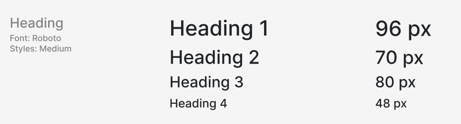

**Body**

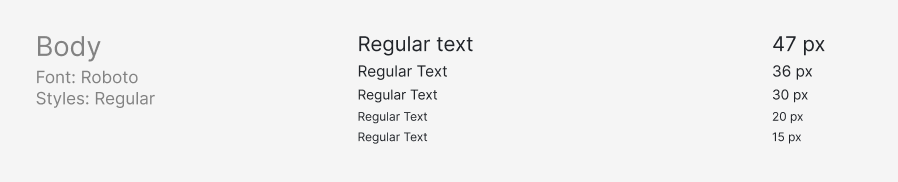

**Colors**

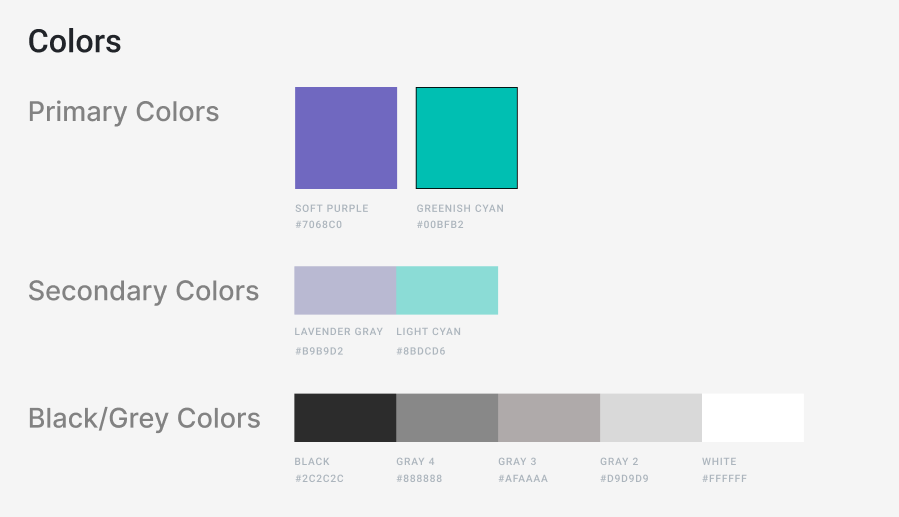

**Spacing**

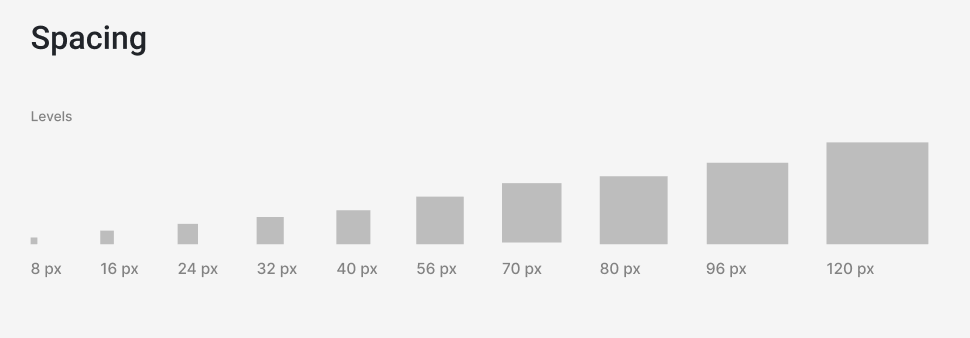

**Primary Colors** (Soft Purple y Greenish Cyan):

Soft Purple (#7068C0): Este tono de morado suave evoca una sensación de calma y profesionalismo. Se utiliza para resaltar elementos clave y para darle a la aplicación un toque moderno y agradable sin ser abrumador.

Greenish Cyan (#00BFB2): Este cian verdoso aporta frescura y vitalidad al diseño. Es ideal para destacar acciones importantes en la interfaz, como botones de llamada a la acción o secciones que requieren la atención del usuario.

**Secondary Colors** (Lavender Gray y Light Cyan):

Lavender Gray (#B9B9D2): Un gris lavanda que complementa los colores primarios, aportando un tono suave y neutro que ayuda a equilibrar el diseño, sin distraer la atención del contenido principal.

Light Cyan (#8BDCD6): Un cian claro que se utiliza para crear espacios visuales limpios y agradables. Es perfecto para fondos o áreas de información secundaria, manteniendo la interfaz ligera y fácil de navegar.

**Black/Grey Colors**:

Estos tonos de negro y gris proporcionan un buen contraste para los textos, iconos, y otros elementos gráficos, asegurando legibilidad y claridad sin comprometer la estética moderna de la aplicación.

En conjunto, esta paleta de colores no solo mejora la apariencia visual de Ez.vet, sino que también refuerza la percepción de una herramienta confiable y eficiente para veterinarios y dueños de mascotas. La elección de colores transmite serenidad y claridad, esenciales para un entorno clínico y de gestión de salud.

**Brand Overview**

Ez.vet es una aplicación digital innovadora diseñada específicamente para clínicas veterinarias, que transforma la manera en que los veterinarios gestionan sus operaciones internas y se conectan con los dueños de mascotas. En un entorno donde la eficiencia y la comunicación transparente son esenciales para el éxito de los servicios veterinarios, Ez.vet se presenta como la solución perfecta que facilita la organización de historiales clínicos, la gestión de inventarios y la programación de recordatorios. Además, Ez.vet permite a los propietarios de mascotas acceder a la información clínica de sus animales en cualquier momento, fortaleciendo la relación y la confianza entre la clínica y sus clientes.

**Brand Name**

El nombre "Ez.vet" combina de manera estratégica dos conceptos clave: "Easy" (fácil) y "Vet" (veterinario). Este nombre encapsula la misión principal de la aplicación: hacer más fácil y accesible la gestión de las clínicas veterinarias, mejorando la eficiencia operativa y la experiencia tanto de los veterinarios como de los dueños de mascotas. "Ez.vet" es moderno, corto y fácil de recordar, lo que refuerza su identidad en el mercado de servicios veterinarios, destacando como una herramienta esencial para la gestión clínica en el ámbito digital.

A continuación, se presenta el logo o marca de nuestra solución propuesta.

### 4.1.2. Web Style Guidelines
Crearemos una aplicación que se adapte a cualquier dispositivo tecnológico, manteniendo la integridad del diseño del contenido. Para ello, tendremos en cuenta las características específicas de cada tipo de dispositivo, garantizando una estructura de contenido óptima para cada uno.

Un aspecto fundamental de nuestro diseño es la implementación del patrón en forma de Z, que orienta al usuario de forma intuitiva desde la esquina superior izquierda hasta la inferior derecha, facilitando un acceso rápido y eficiente a la información clave.

## 4.2. Information Architecture
Esta sección aborda los elementos esenciales del contenido visual, los estilos, etiquetas, y otros aspectos importantes que se considerarán durante el desarrollo del sitio web y landing page.
### 4.2.1. Organization Systems

**Estructura Jerárquica**

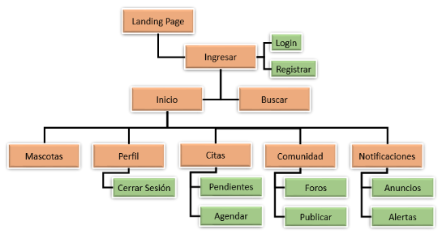

### 4.2.2. Labeling Systems
Los sistemas de etiquetas intentan describir categorías, opciones y enlaces en un lenguaje comprensible a nuestros usuarios y sus clientes. Las etiquetas definidas son las siguientes:

**Inicio.-** Página principal del sitio web
**Sesión.-** Iniciada como usuario de tipo cliente o veterinario.
**Nombre de Usuario.-** Valor único creado en registro
**Contraseña.-** Clave creada en registro
**Tienda.-** Catálogo de productos dividido en productos generales y farmacia.
**Citas .-** Visitas veterinarias agendadas a ciertas fechas, en un local, para un paciente y con un doctor.
**Correo .-** Dirección de correo electrónico
**Ubicación .-** Dirección física de un local veterinario
**Nosotros.-** Información relevante acerca del local veterinario junto con el producto ez.vet.

### 4.2.3. SEO Tags and Meta Tag

**Palabra clave primaria.-** Veterinaria

Etiquetas de optimización de búsqueda SEO y descripción Meta por página del sitio:

**Landing page.-** Atención veterinaria profesional para mascotas - Tienda y Farmacia de animales.
Sistema seguro para locales de veterinaria que facilita el servicio para los usuarios y clientes.

**Citas.-** Agenda una cita veterinaria para tu mascota
Horarios disponibles, consultas

**Ingresar.-** Inicio de sesión ez.vet
Registro a la plataforma - Login or Signup

**Contacto.-** Contáctanos - Correo y Ubicación
Correo electrónico y Ubicación de local.

**Nosotros.-** Quienes somos - [nombre veterinaria] ez.vet
Conoce a nuestros doctores y nuestro equipo.

Además, las imágenes utilizadas llevan el atributo de texto Alt con descripciones breves.

### 4.2.4. Searching Systems

Dentro de la aplicación web se consideran 3 sistemas de búsqueda dedicados.

**Búsqueda general.-** Explora el contenido completo de la aplicación web.

**Búsqueda Comunidad.-** Explora publicaciones de los foros en la sección comunidad.

**Búsqueda de citas agendadas.-** Encuentra citas agendas en la sección citas.

### 4.2.5. Navigation Systems

El landing page utiliza una barra de botones superior para su baja cantidad de opciones. La aplicación web utiliza una barra lateral como sistema de navegación dedicado a las secciones principales del aplicativo:

**Inicio, Mascotas, Perfil, Citas, Comunidad. Botón de Notificaciones.**

## 4.3. Landing Page UI Design
### 4.3.1. Landing Page Wireframe

**Wireframe Destkop:**

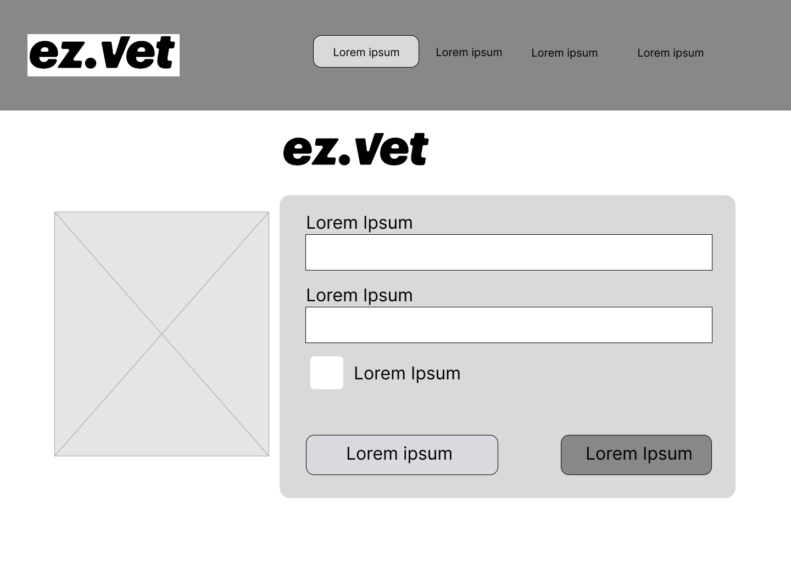
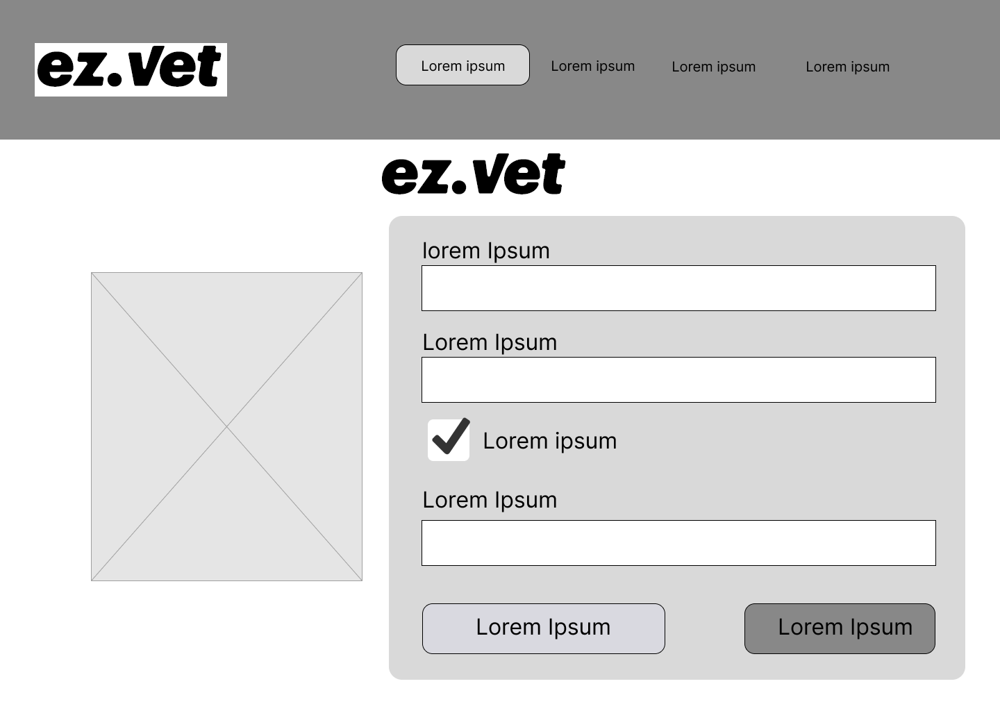
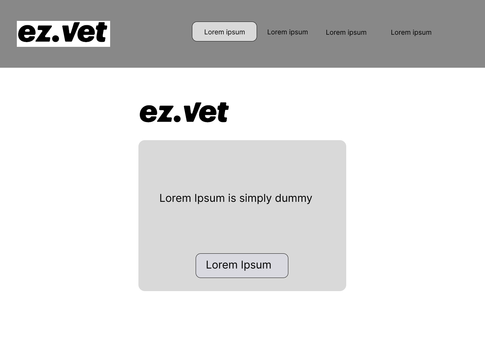

**Wireframe Mobile:**

 En la versión mobile el navbar se reemplaza por un menu desplegable.

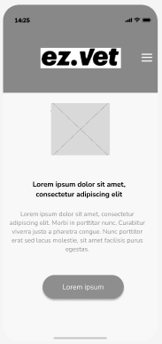
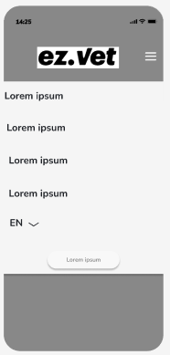
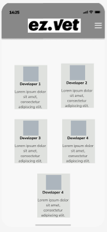
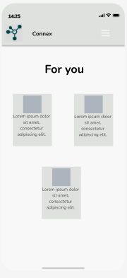
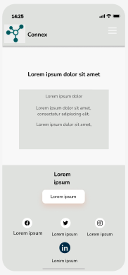

### 4.3.2. Landing Page Mock-up
**Mock-up Destkop:**

**Mock-up Mobile:** En la versión mobile el navbar se reemplaza por un menu desplegable.
## 4.4. Web Applications UX/UI Design
### 4.4.1. Web Applications Wireframes
Wireframe Destkop:

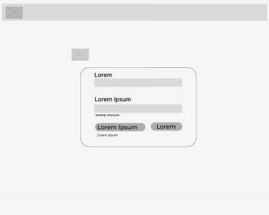

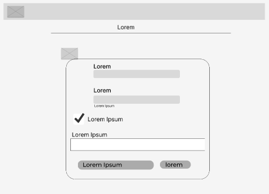

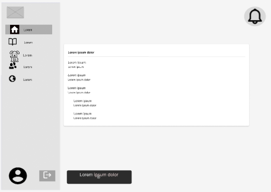

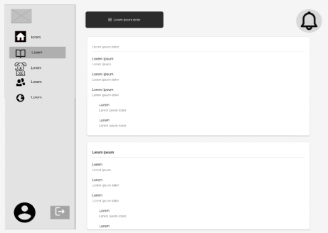

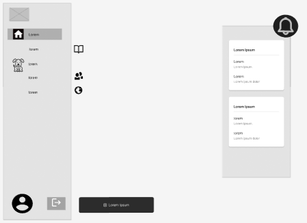

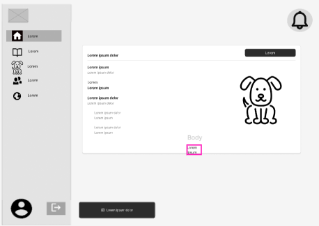

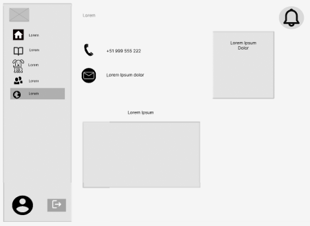

Wireframe Mobile En la versión mobile el navbar se reemplaza por un menu desplegable.

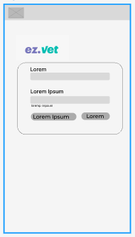
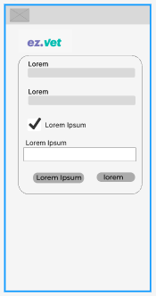
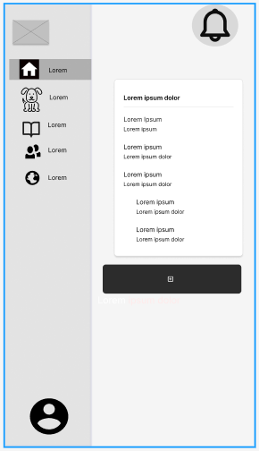
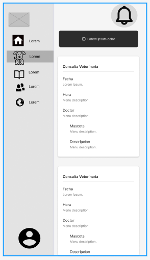
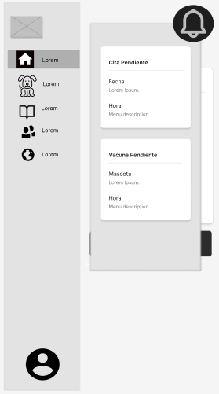
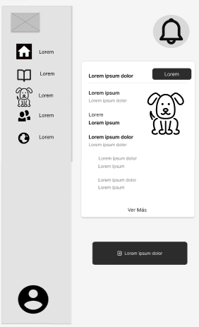
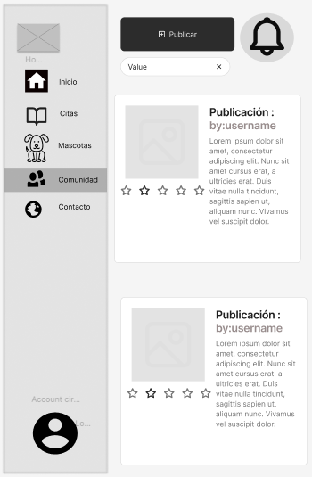
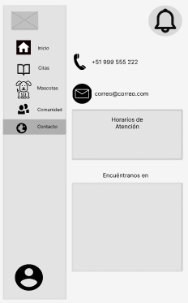

### 4.4.2. Web Applications Wireflow Diagrams
### 4.4.3. Web Applications Mock-ups

### 4.4.4. Web Applications User Flow Diagrams
## 4.5. Web Applications Prototyping
## 4.6. Domain-Driven Software Architecture
Se presentan tres niveles del modelo C4 en el proyecto para tener un mejor enfoque del proyecto que se desarrolla.
### 4.6.1. Software Architecture Context Diagram
El diagrama de contexto presenta una visión global de ez.vet, destacando las principales interacciones entre el sistema y los actores externos. ez.vet cuenta con dos tipos de usuarios principales: dueños de mascotas y veterinarios. Además, interactúa con dos sistemas externos clave: Payment System para realizar pagos y Email System para enviar emails de verificación.

### 4.6.2. Software Architecture Container Diagrams
 El diagrama de contenedores detalla los principales componentes del sistema y cómo se relacionan entre sí. ez.vet consta de los siguientes elementos clave: Aplicación Web y la landing page. Además  realizan llamadas a una API central (Api Application), que sirve como el motor que procesa las solicitudes y gestiona la lógica de negocio. También se visualizan las tecnologías específicas que se usarán en el desarrollo de la aplicación web, como frameworks front-end, back-end, bases de datos, entre otros.
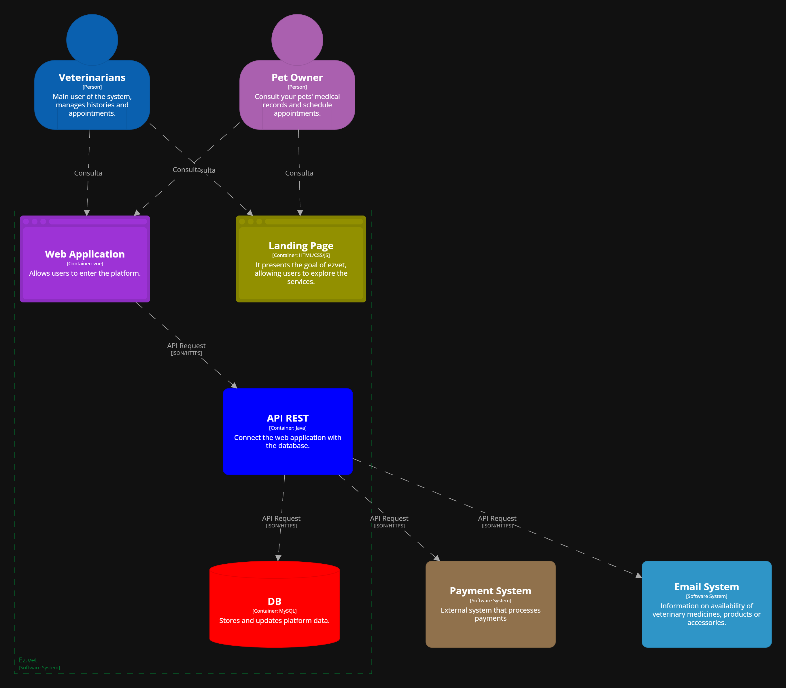

### 4.6.3. Software Architecture Components Diagrams
Este diagrama profundiza en la API Application, mostrando sus diferentes Bounded Contexts. Cada contexto delimitado representa un área funcional del sistema, con responsabilidades claras y separadas. Proporciona una vista más detallada de cómo se organiza la lógica de negocio dentro de la aplicación y cómo los distintos módulos interactúan entre sí para cumplir con los requisitos funcionales del sistema.

## 4.7. Software Object-Oriented Design
### 4.7.1. Class Diagrams
el diagrama de clases se realizó con la ayuda de la herramienta LucidChart
link: <https://acortar.link/hZI08C>

### 4.7.2. Class Dictionary
|**vet**|||
| :- | :- | :- |
|**atributo**|**tipo de dato**|**descripción** |
|id\_vet|string|identificación única del veterinario (llave primaria)|
|id\_clinic|string|identificación única de la clínica (llave foránea)|
|name|string|Nombre del veterinario |
|specialty|string|Especialidad del veterinario|
|num\_license|int|Número de licencia del veterinario|
|work\_schedule|string|Horario de trabajo registrado del veterinario|

|**diagnoses**|||
| :- | :- | :- |
|**atributo**|**tipo de dato**|**descripción** |
|id\_diagnoses|int|identificación única de un diagnóstico (llave primaria)|
|name\_diagnoses|string|nombre de un diagnóstico.|
|details\_diagnoses|string|detalle textual de un diagnóstico |

|**propetaries**|||
| :- | :- | :- |
|**atributo**|**tipo de dato**|**descripción** |
|id\_propetaries|int|identificación única del propietario (llave primaria)|
|lastname|string|Apellidos del usuario|
|email|string|Correo electronico  del usuario|
|password|int|Contraseña del usuario|
|phone|int |Número de celular del usuario|

|**pay**|||
| :- | :- | :- |
|**atributo**|**tipo de dato**|**descripción** |
|id_pay|int|identificación única de pago (llave primaria)|
|id_payment_proof|int|identificación única del comprobante de pago(llave foránea) |
|date|int|Fecha del pago registrado|
|amount|int|Monto del pago registrado|
|payment_method|string|método de pago registrado|
|transaction_status|string|estado de la transacción realizada|

|**products**|||
| :- | :- | :- |
|**atributo**|**tipo de dato**|**descripción** |
|id_products|int|identificación única del producto (llave primaria)|
|name|string|nombre del producto|
|

description
|string|descripción del producto |
|stock|int|si esta disponible el producto  |
|price|int|precio del producto |

|**treatment_assignments**|||
| :- | :- | :- |
|**atributo**|**tipo de dato**|**descripción** |
|id_vet|int|identificación única del veterinario (llave foránea)|
|id_treatment|int|identificación única del tratamiento (llave foránea)|

|**payment_receipts**|||
| :- | :- | :- |
|**atributo**|**tipo de dato**|**descripción** |
|id_payment_receipts|int|identificación única del comprobante de pago (llave primaria)|
|name_payment_receipts|string|nombre realizado al comprobante de pago.|
|type|string|tipo del comprobante de pago, boleta o factura.|
|details|string|detalle del comprobante de pago|
|date_done|int|fecha en la que se realizó el comprobante de pago|

|**treatment_product**|||
| :- | :- | :- |
|**atributo**|**tipo de dato**|**descripción** |
|id_product|int|identificación única del producto (llave foránea)|
|id_treatment|int|identificación única del tratamiento (llave foránea)|
|dose|string|dosis de tratamiento registrado|

|**treatments**|||
| :- | :- | :- |
|**atributo**|**tipo de dato**|**descripción** |
|id_treatments|int|identificación única del tratamiento (llave primaria)|
|date|int|fecha del tratamiento registrado|
|type_treatments|string|tipo de tratamiento registrado|
|grades|string|notas del tratamiento registrado|
|cost|int|costo del tratamiento registrado|

|**patients**|||
| :- | :- | :- |
|**atributo**|**tipo de dato**|**descripción** |
|id_paciente|int|identificación única del paciente (llave primaria)|
|id_owner|int |identificación única del usuario (llave foránea)|
|pet_name|string|nombre de la mascota registrada|
|date_ofbirth |int|fecha de nacimiento de la mascota registrado|
|age|int|La edad de la mascota se expresa en años, meses y días.|
|sex|string|sexo de la mascota registrada|
|weight|int |peso de la mascota registrada|

|**dog_breeds**|||
| :- | :- | :- |
|**atributo**|**tipo de dato**|**descripción** |
|id_breeds|int|identificación única de la raza (llave primaria)|
|id_species|int |identificación única de la especie (llave foránea)|
|name_breeds|string|nombre asociado a una raza|
|description_breeds|string|descripción textual de las características de una raza|

|**crosses**|||
| :- | :- | :- |
|**atributo**|**tipo de dato**|**descripción** |
|id_race|int|identificación única de la raza (llave foránea)|
|id_patient|int |identificación única de un paciente (llave foránea)|
|description_crosses|string|descripción textual de las características del cruce|

|**species**|||
| :- | :- | :- |
|**atributo**|**tipo de dato**|**descripción** |
|id_species|int |identificación única de la especie (llave primaria)|
|name_species|string|nombre asociado a una especie|
|species_description|string|descripción textual de las características de una especie.|

## 4.8. Database Design
Para el esquema de base de datos se utilizó LucidChart: 
## 4.8.1. Database Diagram

.png)
link: <https://acortar.link/0aN0eC> 
