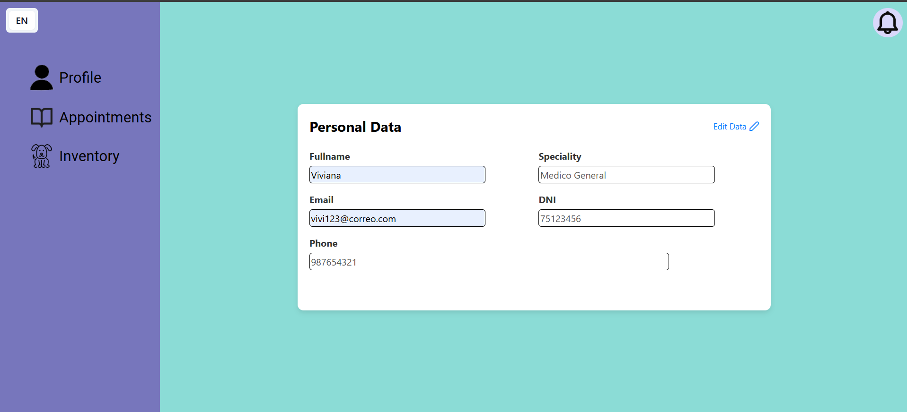

# Capítulo V: Product Implementation, Validation & Deployment
La implementación, validación y despliegue del producto son esenciales para asegurar que la visión del producto se convierta en una realidad funcional y accesible para nuestros usuarios. Estas etapas nos permiten transformar el diseño conceptual en una aplicación real, probada y lista para su uso, lo que nos ayuda a validar nuestras ideas, identificar posibles problemas y ofrecer una experiencia de usuario óptima.

## 5.1. Software Configuration Management
La gestión de la configuración del software es crucial para nuestro trabajo, ya que nos permite mantener un control preciso sobre los elementos de nuestro proyecto, como el código fuente, los documentos de diseño y los activos digitales. Esto garantiza que todos los miembros del equipo estén trabajando con la misma versión de los archivos y facilita la colaboración entre desarrolladores, diseñadores y otros profesionales involucrados en el proyecto.

### 5.1.1. Software Development Environment Configuration

- ### Project Management:
    * ### Trello:
      Una aplicación de gestión de proyectos que facilita el seguimiento de las tareas individuales de cada miembro del equipo de manera sencilla. <br>
      [Link De Registro o Inicio De Sesión](https://trello.com/es)<br>
      
      *  ### Microsoft Teams
       una plataforma unificada de comunicación y colaboración que combina chat persistente en el lugar de trabajo, reuniones de video, almacenamiento de archivos e integración de aplicaciones. <br>
        [Link De Registro o Inicio De Sesión](https://www.microsoft.com/es-pe/)

- ### Requirement Management:
    * ### Miro:
      Un sistema que ofrece una amplia gama de plantillas diseñadas para abordar diversos aspectos en la creación y gestión de proyectos. <br>
      [Link De Registro o Inicio De Sesión](https://miro.com/es/login/)
      
    * ### UXPressia:
      Es una herramienta en línea que simplifica el proceso de mapeo y comprensión de las necesidades del cliente en un proyecto determinado. <br>
      [Link De Registro o Inicio De Sesión](https://uxpressia.com)
      
    * ### Structurizr:
      Se trata de una suite de herramientas que posibilita la creación colaborativa de modelos C4 para representar de forma gráfica nuestros productos. <br>
      [Link De Registro o Inicio De Sesión](https://structurizr.com)
- ###  Product UX/UI Design:
    * ### Figma:
      Una herramienta de colaboración que facilita el desarrollo conjunto de wireframes y mockups. <br>
      [Link De Registro, Inicio De Sesión y Descarga](https://www.figma.com/downloads/)
    * ### LucidChart:
      Una herramienta colaborativa que posibilita la creación conjunta de wireframes flow y mockups flow. <br>
      [Link De Registro o Inicio De Sesión ](https://www.lucidchart.com/pages/es)
      
- ###  Software Development:
    * ### HTML5:
      Es un lenguaje de etiquetado utilizado para crear la estructura a páginas web. Lo utilizamos para incluir componentes como texto, imágenes, enlaces, botones y videos en nuestras páginas web. <br>
      [Información Relacionada](https://www.esic.edu/rethink/tecnologia/html5-que-es-caracteristicas-y-como-funciona-c#:~:text=El%20HTML5%20es%20un%20estándar,%2C%20estilo%20de%20letra%2C%20etc.)
      
    * ### CSS:
      Un lenguaje de diseño gráfico utilizado para dar formato y estilo a la presentación de un documento escrito en HTML. <br>
      [Información Relacionada](https://developer.mozilla.org/es/docs/Web/CSS)
      
    * ### JavaScript:
      Un lenguaje de programación orientado a objetos dinámico que utilizamos para implementar funcionalidades en un documento HTML. <br>
      [Información Relacionada]( https://developer.mozilla.org/es/docs/Web/JavaScript )
      
    * ### WebStorm:
      Un entorno de desarrollo integrado (IDE) que emplearemos para trabajar con JavaScript. <br>
      [Link De Descarga]( https://www.jetbrains.com/es-es/webstorm/)

- ###  Software Testing:
    * ### Lenguaje Gherkin:
      Se trata de un Lenguaje Específico de Dominio (DSL), diseñado específicamente para abordar un problema particular. Es un lenguaje comprensible para los desarrolladores, destinado a resolver necesidades concretas. <br>
- ###  Software Documentation:
    * ### Github:
      Se trata de una plataforma utilizada para el alojamiento de versiones del código fuente de un proyecto. Es una herramienta ampliamente popular en el trabajo colaborativo de programadores. <br>
      [Link De Descarga]( https://desktop.github.com)
      [Link De Registro o Inicio De Sesión](https://github.com/login)
- ###  Software Deployment:
    * ### GitHub Pages: 
      Una plataforma que posibilita la realización de despliegues simples directamente desde un repositorio de GitHub. <br>
      
### 5.1.2. Source Code Management

Landing Page Repository: [Landing Page Repository](link)
- #### GitFlow Implementation:
Para implementar el flujo de trabajo Gitflow utilizando Git como nuestra herramienta de control de versiones, nos basamos en la entrada de blog "A successful Git branching model" de Vincent Driessen. Esta referencia nos permitió establecer las convenciones detalladas que serán aplicadas en nuestro proyecto 

### **Master o Main branch**
La rama principal de desarrollo del proyecto es la Master branch. En esta rama reside el código que actualmente se encuentra en producción.
#### Notación: master o main

### **Develop branch**
La rama "Develop" albergará las más recientes actualizaciones y cambios agregados que serán incluidos en la próxima versión del proyecto. Esta rama sirve como un espacio para la integración y prueba continua de los cambios antes de ser fusionados con la rama principal "Master" para su despliegue en producción.
#### Notación: develop

### **Release branch**
La rama de lanzamiento (Release branch) facilitará la preparación de una nueva versión del producto. Esta rama permitirá la corrección de errores y permitirá que la rama Develop reciba más actualizaciones.
<br>Debe derivarse de la rama Develop.
<br>Debe fusionarse con la rama Develop y Master.
#### Notación: release


### **Feature branch**
Las ramas de características (Feature branches) serán empleadas para desarrollar nuevas funcionalidades o características del producto que se agregarán en la siguiente versión o en versiones futuras. Estas funcionalidades deberán fusionarse eventualmente con la rama Develop.
<br>Debe derivarse de la rama Develop.
<br>Debe fusionarse de vuelta a la rama Develop.
#### Notación: release


### **Hotfix branch**
La rama de corrección rápida (Hotfix branch) se empleará para resolver y actuar de manera inmediata ante posibles errores en la versión en producción del producto. La característica principal de esta rama es que permite preparar una solución rápida mientras el resto del equipo continúa trabajando en otras funcionalidades o mejoras.
<br>Debe derivarse de la rama Master
<br>Debe fusionarse con la rama Develop y Master
#### Notación: hotfix

### **Support branch**
### **Conventional Commits**
"Conventional Commits" es una convención para estructurar los mensajes de confirmación (commits) en un formato estándar y semántico. Este formato ayuda a comunicar claramente los cambios realizados en el código y facilita la generación de registros de cambios automáticos. Los "Conventional Commits" suelen seguir un formato que incluye un encabezado, un cuerpo opcional y un pie de página opcional, y se utilizan para describir de manera sucinta y clara los cambios realizados en el código, lo que facilita su seguimiento y comprensión por parte de los desarrolladores y otros miembros del equipo.
<br>
La estructura de un commit debe seguir las siguientes pautas:
~~~
git commit -m “<type>[optional scope]: <title>“ -m “<description”
~~~
**Tipos De Conventional Commits**
~~~
1. feat: Used to describe a new feature or functionality added to the code.
2. fix: Indicates a bug fix or solution to a problem.
3. docs: Employed for changes or improvements in code documentation.
4. style: Describes changes related to the code's formatting, such as whitespace, indentation, etc., that do not affect its functionality.
5. refactor: Used for modifications to the code that do not fix bugs or add new features, but rather improve its structure or readability.
6. test: Indicates the addition or modification of unit tests or functional tests.
7. chore: Used for changes in the build process or maintenance tasks that are not directly related to the code itself.
8. perf: Describes performance improvements in the code.
~~~

### 5.1.3. Source Code Style Guide & Conventions

Como norma general, se espera que todo el código desarrollado por los miembros del equipo esté completamente redactado en inglés.
- ### HTML 
    - #### Use Lowercase Element Names:
        Es recomendable utilizar minúsculas o lowercase para los nombres de los elementos HTML.
        ~~~ 
      <body>
            <p>This is a paragraph</p>
      <body>
       ~~~
    - #### Close All HTML Elements:
        Es recomendable cerrar todos los elementos HTML correctamente.
        ~~~ 
      <body>
            <p>This is a paragraph</p>
            <p>This is another paragraph</p>
      <body>
       ~~~
    - #### Use Lowercase Attribute Names:
        Es recomendable utilizar minúsculas para los nombres de los atributos HTML.
      ~~~ 
      <a href="https://www.w3schools.com/html/">Visit our HTMLtutorial</a>
       ~~~
    - #### Always Specify alt, width, and height for Images:
      Es recomendable seguir estas convenciones en caso de que la imagen no se pueda mostrar, lo que ayuda a mejorar la accesibilidad del contenido.
      ~~~ 
      
      ~~~ 
    - #### Spaces and Equal Signs:
      Se recomienda no utilizar espacios en blanco entre las entidades para mejorar la legibilidad.
      ~~~ 
      <link rel="stylesheet" href="styles.css">
      ~~~ 
- ### CSS
    - #### ID and Class Naming
      Es recomendable utilizar nombres de clases e id's significativos que expresen claramente el propósito del elemento.
      ~~~ 
      #gallery {}
      #login {}
      .video {}
       ~~~
    - #### ID and Class Name Style
      Se recomienda utilizar nombres cortos para nombrar ids o clases, pero lo suficientemente descriptivos para entender su propósito.
      ~~~ 
      #nav {}
      .author {}
      ~~~
    - #### Shorthand Properties
      Se recomienda utilizar propiedades CSS de forma abreviada siempre que sea posible para hacer el código más eficiente y comprensible.
       ~~~ 
       border-top: 0;
       font: 100%/1.6 palatino, georgia, serif;
       padding: 0 1em 2em;
       ~~~ 
    - #### 0 and Units
      Es recomendable evitar especificar la unidad después del valor 0 en propiedades que lo permitan, ya que esto ayuda a reducir el tamaño del código y mejora su legibilidad.
       ~~~ 
       margin: 0;
       padding: 0;
       ~~~
     - #### Declaration Order
       Se recomienda ordenar las declaraciones en orden alfabético para facilitar el mantenimiento y la recordación del código.
       ~~~ 
        background: fuchsia;
        border: 1px solid;
        border-radius: 4px;
        color: black;
        text-align: center;
        text-indent: 2em;
       ~~~  
- ### JAVASCRIPT
     - #### Use expanded syntax
       Cada línea de JavaScript debería estar en una nueva línea, con la llave de apertura en la misma línea de su declaración y la llave de cierre en una nueva línea al final.
       ~~~ 
       function myFunc() {
        console.log('Hello!');
       };
       ~~~
     - #### Variable naming
       Para el nombre de las variables, se recomienda utilizar lowerCamelCase. 
       ~~~ 
       let playerScore = 0;
       let speed = distance / time;
       ~~~  
     - #### Declaring variables
       Para la declaración de variables, es recomendable utilizar las palabras reservadas let y const en lugar de var.
       ~~~ 
       const myName = 'Chris';
       console.log(myName);
       let myAge = '40';
       myAge++;
       console.log('Happy birthday!');
       ~~~ 
     - #### Function naming
       Para el nombre de las funciones, se recomienda utilizar lowerCamelCase.
       ~~~ 
       function sayHello() {
       alert('Hello!');
       };
       ~~~ 
- ### C#
    - #### PascalCase
      Mayúscula al principio de cada palabra para nombres de clases y métodos.
      ~~~ 
      public class MyClass {
          public void ExampleMethod() {
              // Method code
          }
      }
      ~~~
    - #### camelCase
      Minúscula al principio con mayúsculas para cada palabra subsiguiente para variables y parámetros.
      ~~~ 
      public class MyClass {
          public void ExampleMethod(int exampleNumber) {
              string exampleName = "Example";
              // Method code     
          }
      }
      ~~~
      - #### Reasonable line length
        Mantener líneas de código con longitud adecuada para mejorar la legibilidad.
        ~~~ 
        public class MyClass {
            public void ExampleMethod() {
                string message = "This is an example message that spans multiple lines " +
                                 "to demonstrate how to maintain a reasonable length.";
                 Console.WriteLine(message);  
          }
        }
        ~~~ 
      - #### Clear comments:
          Utilizar comentarios para explicar el propósito del código de manera concisa.
          ~~~ 
          public class MyClass {
              // This method performs an addition operation and returns the result.
              public int Add(int a, int b) {
                return a + b;
               }
          }
          ~~~
    - #### Single responsibility:
      Cada clase o método debe tener una única función bien definida.
      ~~~ 
      // Class responsible for handling basic mathematical operations
      public class MathematicalOperations {
          // Method to add two numbers
          public int Add(int a, int b) {
              return a + b; 
          } 
       
          // Method to subtract two numbers
          public int Subtract(int a, int b) { 
              return a - b; 
          } 
      }
      ~~~
- ### LENGUAJE GHERKIN
    - #### Descriptive and concise titles for scenarios
      Utilizar títulos descriptivos y concisos para los escenarios.
      ~~~ 
      Feature: Login
        Scenario: Successful login
          Given a user is on the login page     
          When they enter valid credentials     
          Then they should be logged in successfully      
      ~~~
    - #### Follow the Given-When-Then structure consistently.
      Seguir la estructura de Given-When-Then de manera consistente.
      ~~~ 
      Scenario: Adding items to the shopping cart
        Given the user is on the shopping page
        When they add an item to the cart
        Then the item should appear in the cart 
      ~~~
    - #### Focus on business-readable language
      Centrarse en un lenguaje legible para el negocio, evitando detalles técnicos de implementación.
      ~~~ 
      Scenario: Changing user settingst
        Given the user is logged in
        When they navigate to the settings page
        Then they should be able to update their profile
      ~~~
    - ####  Utilize Scenario Outline for scenarios with multiple similar cases.
      Utilizar Scenario Outline para escenarios con múltiples casos similares.
      ~~~ 
      Scenario Outline: Searching for products
        Given the user is on the search page
        When they search for "<product>"
        Then they should see search results for "<product>"
      
      Examples:
        | product  |
        | Laptop   |
        | Smartphone |
      ~~~
    - #### Add comments to provide additional context
      Agregar comentarios para proporcionar contexto adicional o explicaciones cuando sea necesario.
      ~~~ 
      # This scenario checks the functionality of the logout feature
      Scenario: User logout
        Given the user is logged in
        When they click on the logout button
        Then they should be redirected to the login page      
      ~~~
      
### 5.1.4. Software Deployment Configuration
- Creación Landing Page:<br>
1. Se crea un repositorio remoto en GitHub

2. Agregar a participantes

3. Habilitamos GitHub Pages en branch "master" y ruta "/(root)"


- Creación Front End App:<br>
1. Creación de repositorio dentro de nuestra organización

2. Agregar a participantes

## 5.2. Landing Page, Services & Applications Implementation
La implementación de la página de inicio, los servicios y las aplicaciones es un paso fundamental en nuestro proceso de desarrollo. Nos permite materializar el diseño y la funcionalidad planificados, transformando los conceptos en productos tangibles y listos para su uso. Esta fase nos permite traducir las especificaciones y requisitos en código, desarrollando la estructura de la página, los servicios y las aplicaciones de acuerdo con las necesidades identificadas.
### 5.2.1. Sprint 
El primer sprint es un hito importante en nuestro proceso de desarrollo ágil. Durante este período, nos enfocamos en la implementación de las características y funcionalidades prioritarias identificadas en la planificación inicial. Esto implica traducir los requisitos y especificaciones en código funcional, desarrollando las bases de nuestro producto de manera iterativa.
#### 5.2.1.1. Sprint Planning 
En la siguiente sección, se presentará el sprint #1 con la versión inicial del trabajo para la entrega del proyecto, detallando la organización, distribución y resultados de la landing page.

|Sprint # |Date |Time |Location |Prepared By |Attendees|
| :- | :- | :- | :- | :- | :- |
|1|1/09/2024 |9:00 pm|Reunión mediante Meet|Sebastian Matias Escobar Palomino|Diego Bastidas, Estrella Ticona , Sebastian De Las Casas, Johan Bottger|
|Sprint 1 Goal |Sprint 1 Velocity |Sum of Story Points||||
|Elaborar y diseñar el landing page informativa para la aplicación Ez-Vet|<p>12</p><p></p>|12||||

#### 5.2.1.2. Sprint Backlog 
Durante el primer sprint, el equipo se centró en desarrollar una landing page que fuera tanto atractiva como funcional, organizando y distribuyendo tareas en el tablero de Sprint de acuerdo con las habilidades de cada integrante.

<table>
	<tbody>
		<tr>
			<td>Sprint #</td>
			<td colspan="7">Sprint 1</td>
		</tr>
		<tr>
			<td colspan="2">User Story</td>
			<td colspan="6">Work - Item / Task</td>
		</tr>
		<tr>
			<td>Id</td>
			<td>Title</td>
			<td>Id</td>
			<td>Title</td>
			<td>Description</td>
			<td>Estimation (Hours)</td>
			<td>Assigned To</td>
			<td>Status (To-do / In-Process / To-Review / Done)</td>
		</tr>
		<tr>
			<td></td>
			<td></td>
			<td>TSK001</td>
			<td>Remote environment creation for Report and Landing Page</td>
			<td>Organization, repositories and branch creation in GitHub</td>
			<td>0</td>
			<td>All team members</td>
			<td>Done</td>
		</tr>
		<tr>
			<td></td>
			<td></td>
			<td>TSK002</td>
			<td>Conclude Chapter01</td>
			<td>Finish all section and add the respective information in chapter01</td>
			<td>5</td>
			<td>All team members</td>
			<td>Done</td>
		</tr>
		<tr>
			<td></td>
			<td></td>
			<td>TSK003</td>
			<td>Conclude Chapter02</td>
			<td>Finish all section and add the respective information in chapter02</td>
			<td>3</td>
			<td>All team members</td>
			<td>Done</td>
		</tr>
		<tr>
			<td></td>
			<td></td>
			<td>TSK004</td>
			<td>Conclude Chapter03</td>
			<td>Finish all section and add the respective information in chapter03</td>
			<td>5</td>
			<td>All team members</td>
			<td>Done</td>
		</tr>
		<tr>
			<td></td>
			<td></td>
			<td>TSK005</td>
			<td>Conclude Chapter04</td>
			<td>Finish all section and add the respective information in chapter04</td>
			<td>19</td>
			<td>All team members</td>
			<td>Done</td>
		</tr>
		<tr>
			<td></td>
			<td></td>
			<td>TSK006</td>
			<td>Conclude Chapter05</td>
			<td>Finish all section and add the respective information in chapter05</td>
			<td>3</td>
			<td>All team members</td>
			<td>Done</td>
		</tr>
    <tbody>
</table>

#### 5.2.1.3. Development Evidence for Sprint Review
En esta sección se explica y presenta los avances en implementación con relación a los productos de la solución según el alcance del Sprint: Landing Page, Web Applications, Web Services.

Primero, se mostrarán los commits más importantes para el Reporte, los cuales muestran el ciclo de vida del proyecto, y toda la información que se usó, usa y usará para el desarrollo del proyecto:
| Repository          | Branch  | Commit ID                                | Commit Message                           | Commit Message Body                                                                                                                                 | Commited on (Date) |
|---------------------|---------|------------------------------------------|------------------------------------------|-----------------------------------------------------------------------------------------------------------------------------------------------------|--------------------|
| VetSolution/Report | develop | 98783487238973c5dd4a8097197adb2cf70af00a | feat: added content in chapter IV        | added content in all sections of chapter04                                                                                                          | 4/9/2024           |
| VetSolution/Report | master  | 889cdc0229a96aa9fca4641ebfccccd71f0d7a5a | feat(assets)                             | added img to master branch                                                                                                                          | 4/9/2024           |


#### 5.2.1.4. Testing Suite Evidence for Sprint Review
Se ha omitido la sección de la aplicación web debido a que solo se ha desarrollado la Landing Page. Se ofrecerá más información sobre la aplicación en una etapa posterior del desarrollo.
#### 5.2.1.5. Execution Evidence for Sprint Review
En esta entrega, el equipo de desarrolladores de VetSolutions ha completado con éxito la implementación y el lanzamiento de la página de la Landing Page. Esta página presenta diferentes secciones que brindan información detallada sobre nuestro producto.

#### 5.2.1.6. Services Documentation Evidence for Sprint Review
Se ha omitido la sección de la aplicación web debido a que solo se ha desarrollado la Landing Page. Se ofrecerá más información sobre la aplicación en una etapa posterior del desarrollo.
#### 5.2.1.7. Software Deployment Evidence for Sprint Review
Se ha omitido la sección de la aplicación web debido a que solo se ha desarrollado la Landing Page. Se ofrecerá más información sobre la aplicación en una etapa posterior del desarrollo.
#### 5.2.1.8. Team Collaboration Insights during Sprint
Durante el transcurso de este sprint, todos participamos de forma activa y constante en la creación de las tareas asignadas. A continuación todos los analíticos que nos proporciona Github, en su apartado de Insights, sobre la colaboración del equipo durante el Sprint 1:


### 5.2.2. Sprint 2
En esta sección se registra y explica el avance en términos de producto y trabajo colaborativo para el Sprint 2. Incluye como secciones internas: Sprint Planning 2, Sprint Backlog 2, Development Evidence for Sprint Review, Execution Evidence for Sprint Review, Services Documentation Evidence for Sprint Review, junto con Team Collaboration Insights during Sprint

#### 5.2.2.1. Sprint Planning 2

|Sprint # |Date |Time |Location |Prepared By |Attendees|
| :- | :- | :- | :- | :- | :- |
|2|20/09/2024 |8:30 pm|Reunión mediante Meet|Sebastian Matias Escobar Palomino|Diego Bastidas, Estrella Ticona , Sebastian De Las Casas, Johan Bottger|
|Sprint 2 Goal |Sprint 2 Velocity |Sum of Story Points||||
|Programar e implementar el código para el frontend|<p>20</p><p></p>|20||||

#### 5.2.2.2. Sprint Backlog 2
En este segundo sprint el equipo se ha enfocado en el mejoramiento de la Landing Page, el reporte y la implementación de la Front End Application. A continuación, se presenta el backlog de tareas para el Sprint 2:
[Link para ingresar al board del segundo Sprint]((https://trello.com/b/KPjETALL/app-web-vetsolutiion))

<table>
	<tbody>
		<tr>
			<td>Sprint #</td>
			<td colspan="7">Sprint 2</td>
		</tr>
		<tr>
			<td colspan="2">User Story</td>
			<td colspan="6">Work - Item / Task</td>
		</tr>
		<tr>
			<td>Id</td>
			<td>Title</td>
			<td>Id</td>
			<td>Title</td>
			<td>Description</td>
			<td>Estimation (Hours)</td>
			<td>Assigned To</td>
			<td>Status (To-do / In-Process / To-Review / Done)</td>
		</tr>
		<tr>
			<td></td>
			<td></td>
			<td>TSK008</td>
			<td>Remote environment creation for Front End App</td>
			<td>repositories and branch creations for Web Application in GitHub</td>
			<td>0</td>
			<td>All team members</td>
			<td>Done</td>
		</tr>
		<tr>
			<td></td>
			<td></td>
			<td>TSK009</td>
			<td>Update Chapter01</td>
			<td>add the respective information resulting from the observations made in the review in chapter01</td>
			<td>5</td>
			<td>All team members</td>
			<td>Done</td>
		</tr>
		<tr>
			<td></td>
			<td></td>
			<td>TSK010</td>
			<td>Update Chapter02</td>
			<td>add the respective information resulting from the observations made in the review in chapter02</td>
			<td>1</td>
			<td>All team members</td>
			<td>Done</td>
		</tr>
		<tr>
			<td></td>
			<td></td>
			<td>TSK011</td>
			<td>Update Chapter03</td>
			<td>add the respective information resulting from the observations made in the review in chapter03</td>
			<td>2</td>
			<td>All team members</td>
			<td>Done</td>
		</tr>
		<tr>
			<td></td>
			<td></td>
			<td>TSK012</td>
			<td>Update Chapter04</td>
			<td>add the respective information resulting from the observations made in the review in chapter04</td>
			<td>6</td>
			<td>All team members</td>
			<td>Done</td>
		</tr>
		<tr>
			<td></td>
			<td></td>
			<td>TSK013</td>
			<td>Update Chapter05</td>
			<td>add the respective information resulting from the observations made in the review in chapter02</td>
			<td>4</td>
			<td>All team members</td>
			<td>Done</td>
		</tr>
    <tbody>
</table>

#### 5.2.2.3. Development Evidence for Sprint Review
En esta sección se explica y presenta los avances en implementación con relación a los productos de la solución según el alcance del Sprint: Landing Page, Web Applications, Web Services.

| Repository          | Branch  | Commit ID                                | Commit Message                                                                         | Commit Message Body        | Commited on (Date) |
|---------------------|---------|------------------------------------------|----------------------------------------------------------------------------------------|----------------------------|--------------------|
| JDu202012207/Report | develop | 771e52970c40273864623683573ae900bda62fd8 | Merge branch 'feat-chapter01' of https://github.com/Ez-Vet/Frontend                    | -                          | 9/20/2024          |
| JDu202012207/Report | develop | 219b131d79d8a800f0c5175b9c05b69ff87646cc | Merge: merging chapter02 features.                                                     | -                          | 9/20/2024          |
| JDu202012207/Report | develop | 271962ab497af6c8fd38596dc9dd6a576c6d6501 | Merge branch 'feat-chapter03' of https://github.com/Ez-Vet/Frontend                    | -                          | 9/20/2024          |
| JDu202012207/Report | develop | 7bca55d1ecdb7cb94597e8680a455c5b12b7138d | Merge: merging chapter04 features.                                                     | -                          | 9/20/2024          |
| JDu202012207/Report | develop | 5c076afbe3f51057e7ef3a7631c50fe109ed895c | Merge branch 'feat-chapter05' of https://github.com/Ez-Vet/Frontend                    | -                          | 9/20/2024          |

Ahora, se mostrarán los commits más importantes para el arreglo según las observaciones hechas a la Landing Page:

| Repository                   | Branch | Commit ID                                | Commit Message | Commit Message Body                    | Commited on (Date) |
|------------------------------|--------|------------------------------------------|----------------|----------------------------------------|--------------------|
| s4ck1to99/LandingPageFlexPal | master | 51d1e22858cd8356c12bc86d530eda3935e6b3e5 | refactor       | Language spanish to english index.html | 21/9/2024          |

Por último, se mostrarán los commits más importantes para la implementación de la Front End Application:

| Repository               | Branch  | Commit ID                                | Commit Message                                                                                              | Commit Message Body | Commited on (Date) |
|--------------------------|---------|------------------------------------------|-------------------------------------------------------------------------------------------------------------|---------------------|--------------------|
| JDu202012207/FrontEndApp | develop | b42abd3bba01d16451479486cdf2f645a04ee0b8 | Merge branch 'develop-feat' of https://github.com/Ez-Vet/Frontend into develop-features                     | -                   | 9/20/2024          |
| JDu202012207/FrontEndApp | develop | b60a6a683a57fd1846c92a34dc178398222c197d | feat(community): merging develop-features.                                                                  | -                   | 9/20/2024          |
| JDu202012207/FrontEndApp | develop | a462141f1691d2088990c2f1368e90fe2aeb6d92 | feat(login): merging develop-features.                                                                      | -                   | 9/20/2024          |
| JDu202012207/FrontEndApp | develop | d7e07b9e25701116aadadf8aa1d5899d27fb60e2 | feat(pets): merging develop-features.                                                                       | -                   | 9/20/2024          |
| JDu202012207/FrontEndApp | develop | ebd6d62b629882a357f5b253c07b6d34439ee16a | feat(appointments): merging develop-features.                                                               | -                   | 9/20/2024          |
| JDu202012207/FrontEndApp | develop | 7ef52c3ca1034b0d81cc3bf170dc0b325b314408 | fix: fixed merging develop-features.                                                                        | -                   | 9/20/2024          |
| JDu202012207/FrontEndApp | develop | e78c9c50638df5b9078dc3b50d0762c06bea697d | Merge branch 'develop-feat-session' of https://github.com/Ez-Vet/Frontend into develop-features             | -                   | 9/20/2024          |
| JDu202012207/FrontEndApp | develop | 4d6b89ce8efb40d60e614c3b133f65f06eb5859c | fix: fixed merging develop-features.                                                                        | -                   | 9/20/2024          |


#### 5.2.2.4. Testing Suite Evidence for Sprint Review
Se ha omitido la sección de la aplicación web debido a que solo se ha desarrollado la Landing Page. Se ofrecerá más información sobre la aplicación en una etapa posterior del desarrollo.
#### 5.2.2.5. Execution Evidence for Sprint Review
En esta entrega, el equipo de desarrolladores de FlexPal ha completado con éxito la implementación y el lanzamiento de la página de la Landing Page. Esta página presenta diferentes secciones que brindan información detallada sobre nuestro producto.

También se ha completado la implementación de la Front End Application, que presenta una interfaz de usuario interactiva y funcionalidades básicas para los usuarios. A continuación, se presentan algunas capturas de pantalla de la aplicación en funcionamiento:


#### 5.2.2.6. Services Documentation Evidence for Sprint Review
En este sprint, hemos podido desplegar una Web Application que consume json como data para mostrárselos al usuario, a continuación se muestra el código de la aplicación:

| Nombre del Endpoint        | Acciones Implementadas | Sintaxis de Llamada                                                   | Especificación de Parámetros                         | Ejemplo de Llamada                                                                                                                                                                                                                                                                                                             | Explicación del Response                                                                                                                      |
|----------------------------|------------------------|-----------------------------------------------------------------------|------------------------------------------------------|--------------------------------------------------------------------------------------------------------------------------------------------------------------------------------------------------------------------------------------------------------------------------------------------------------------------------------|-----------------------------------------------------------------------------------------------------------------------------------------------|
| pet-api.service.json       | GET                    | ```axios.get("src/app/services/appointment-api.service.json")```      | Ya que es un GET, los parámetros que se piden son id | ```fetchPet() {```<br>```axios.get("src/app/services/pet-api.service.json")```<br>```.then(response => {```<br>```console.log(response.data);```<br>```this.coaches = response.data.pet;```<br>```})```<br>```.catch(error => {```<br>```console.error('Error fetching pets:', error);```<br>```});```<br>```}``` | En este caso, se está devolviendo el valor de todos los objetos "pet" alojados en el json con el nombre 'pet-api.service.json'.        |
| appointment-api.service.json | GET                  | ```axios.get("src/app/services/appointment-api.service.json")```      | Ya que es un GET, los parámetros que se piden son id | ```fetchAppointment() {```<br>```axios.get("src/app/services/appointment-api.service.json")```<br>```.then(response => {```<br>```console.log(response.data);```<br>```this.coaches = response.data.appointment;```<br>```})```<br>```.catch(error => {```<br>```console.error('Error fetching appointment:', error);```<br>```});```<br>```}``` | En este caso, se está devolviendo el valor de todos los objetos "appointments" alojados en el json con el  nombre 'appointment-api.service.json'. |

A continuación, fotos de como lucen los endpoints dentro de nuestro código y el lugar donde se está consumiendo la data en nuestra web application:

## Home

## Login


## Pet


## Appointment


#### 5.2.2.7. Software Deployment Evidence for Sprint Review
Se ha omitido la sección de la aplicación web debido a que solo se ha desarrollado la Landing Page. Se ofrecerá más información sobre la aplicación en una etapa posterior del desarrollo.
#### 5.2.2.8. Team Collaboration Insights during Sprint
Durante el transcurso de este sprint, todos participamos de forma activa y constante en la creación de las tareas asignadas. A continuación todos los analíticos que nos proporciona Github, en su apartado de Insights, sobre la colaboración del equipo durante el Sprint 2:

## 5.2.3 Sprint 3
### 5.2.3.1. Sprint Planning 3
El Sprint #3 comienza el 10 de octubre de 2024, y su objetivo es solucionar errores en la aplicación web y desarrollar el back end de la misma.
### 5.2.3.2. Sprint Backlog 3 
## 5.3. Validation Interviews
### 5.3.1. Diseño de Entrevistas
  ***Segmento 1: Médicos Veterinarios***

1. ¿Que Aplicativo usas?
1. ¿Que te parecio la interacción con Ez.vet?
1. ¿Que es lo que modificarias o añadirias?


***Segmento 2: Dueños de Mascotas***

1. ¿Que te parecio la interacción con Ez.vet?
1. ¿Que es lo que modificarias o añadirias?
1. ¿Que tan sencillo te parecio el uso de Ez.vet?

### 5.3.2. Registro de Entrevistas

   ***Segmento 1: Médicos Veterinarios***

   **Entrevistado N°1: Valentino Tirado**

- **Sexo: Masculino** 
- **Edad: 28 años**
- **Domicilio: Los Olivos** 

**Entrevista:** 

- **Link: https://upcedupe-my.sharepoint.com/:v:/g/personal/u20221a301_upc_edu_pe/EWYEK2jlkx1JjvBRRNSfAasBBzbZKRAyTDySBMdNdyxrLg?nav=eyJyZWZlcnJhbEluZm8iOnsicmVmZXJyYWxBcHAiOiJPbmVEcml2ZUZvckJ1c2luZXNzIiwicmVmZXJyYWxBcHBQbGF0Zm9ybSI6IldlYiIsInJlZmVycmFsTW9kZSI6InZpZXciLCJyZWZlcnJhbFZpZXciOiJNeUZpbGVzTGlua0NvcHkifX0&e=Zd84FB** 
- **Momento en el que Inicia: 0:00 min**
- **Duración: 7:12 min**

**Resumen:**

`	`El doctor Valentino expresó que encuentra sumamente interesante el uso de la herramienta Ez.vet, pues le permitiría optimizar el tiempo que dedica a cada consulta y, de manera especial, agilizar la atención en situaciones de emergencia. Señaló que, al reducir el tiempo de espera y aumentar la eficiencia en el proceso, podría ofrecer un servicio más rápido y efectivo a sus clientes, mejorando notablemente la experiencia de estos y facilitando su propio trabajo. Además, destacó que la herramienta sería particularmente útil en aquellos casos en los que el tiempo es un factor crítico, permitiéndole concentrarse en lo más importante: brindar atención oportuna y de calidad


**Entrevistado N°2: Viviana Armas**

- **Sexo: Femenino** 
- **Edad: 24 años**
- **Domicilio: San Miguel** 

**Entrevista:** 

- **Link: https://upcedupe-my.sharepoint.com/:v:/g/personal/u20221a301_upc_edu_pe/EaNf1ImRbpRPvRwBoOyhmckBRyZQcbDy-LZX2T5FFQDqtA?nav=eyJyZWZlcnJhbEluZm8iOnsicmVmZXJyYWxBcHAiOiJPbmVEcml2ZUZvckJ1c2luZXNzIiwicmVmZXJyYWxBcHBQbGF0Zm9ybSI6IldlYiIsInJlZmVycmFsTW9kZSI6InZpZXciLCJyZWZlcnJhbFZpZXciOiJNeUZpbGVzTGlua0NvcHkifX0&e=vBn1iu** 
- **Momento en el que Inicia: 0:00 min**
- **Duración: 5:00 min**

**Resumen:**

` ` La doctora Viviana recomendó realizar algunos cambios en los colores de ciertas áreas del aplicativo para mejorar su usabilidad. Aun así, en general, le pareció una herramienta muy útil, ya que le permitiría ahorrar tiempo y agilizar los procedimientos clínicos. Además, señaló que, en comparación con Vet Praxis, encuentra Ez.vet mucho más intuitivo y fácil de usar, lo cual considera una ventaja significativa para optimizar su práctica diaria.


**Entrevistado N°3: Noelia Aliaga** 

- **Sexo: Femenino**
- **Edad: 50 años**
- **Domicilio: Magdalena** 

**Entrevista:** 

- **Link: https://upcedupe-my.sharepoint.com/:v:/g/personal/u20221a301_upc_edu_pe/Ef1y_P5oiLhMp_GNakPpocgBuJNRKXMn9W7H0vSvdNwnSQ?nav=eyJyZWZlcnJhbEluZm8iOnsicmVmZXJyYWxBcHAiOiJPbmVEcml2ZUZvckJ1c2luZXNzIiwicmVmZXJyYWxBcHBQbGF0Zm9ybSI6IldlYiIsInJlZmVycmFsTW9kZSI6InZpZXciLCJyZWZlcnJhbFZpZXciOiJNeUZpbGVzTGlua0NvcHkifX0&e=LBaRO3** 
- **Momento en el que Inicia: 0:00 min**
- **Duración: 2:59 min**

**Resumen:**

` `La doctora Noelia comentó que el aplicativo le resulta muy útil, ya que le permitiría ahorrar entre 10 a 15 minutos en cada consulta, dado que actualmente el área de administración le exige registrar primero la historia clínica antes de iniciar la atención. Además, sugirió añadir una sección específica para el área de baños o servicio de grooming, ya que en su veterinaria también ofrecen este servicio, y una opción de este tipo facilitaría la gestión integral de todos los procedimientos que realizan. 


***Segmento 2: Dueños de Mascotas***

**Entrevistado N°1: Sebastián Silva**

- **Sexo: Masculino**
- **Edad: 20**
- **Domicilio: San Luis** 

**Entrevista:** 

- **Link: https://upcedupe-my.sharepoint.com/:v:/g/personal/u20221a301_upc_edu_pe/EfhZu4HwZiVOgiL2HqVkmpcBOXmWa-xzOxdchczVLxoOKQ?nav=eyJyZWZlcnJhbEluZm8iOnsicmVmZXJyYWxBcHAiOiJPbmVEcml2ZUZvckJ1c2luZXNzIiwicmVmZXJyYWxBcHBQbGF0Zm9ybSI6IldlYiIsInJlZmVycmFsTW9kZSI6InZpZXciLCJyZWZlcnJhbFZpZXciOiJNeUZpbGVzTGlua0NvcHkifX0&e=dPUYNk** 
- **Momento en el que Inicia: 0:00 min**
- **Duración: 5:27 min**

**Resumen:**

` `Sebastián Silva considera que la aplicación es altamente innovadora, ya que le permite tener acceso a toda la historia clínica de su mascota desde cualquier lugar, lo cual resulta sumamente práctico. Esta funcionalidad le facilita considerablemente la tarea de llevar consigo las recetas y diagnósticos de su mascota sin necesidad de cargar documentos físicos, mejorando su experiencia al poder consultar toda la información necesaria de manera rápida y ordenada. Para Sebastián, esta característica representa una gran ventaja, especialmente cuando necesita compartir detalles de salud con otros profesionales o en situaciones de emergencia.


**Entrevistado N°2: Jose Roberto**

- **Sexo: Masculino** 
- **Edad: 21 años**
- **Domicilio: San Luis**

**Entrevista:** 

- **Link: https://upcedupe-my.sharepoint.com/:v:/g/personal/u20221a301_upc_edu_pe/EQ2_ye-rGslBixwe4WrNDH0BSb9_uIn0Qlkjd-2vJkqfew?nav=eyJyZWZlcnJhbEluZm8iOnsicmVmZXJyYWxBcHAiOiJPbmVEcml2ZUZvckJ1c2luZXNzIiwicmVmZXJyYWxBcHBQbGF0Zm9ybSI6IldlYiIsInJlZmVycmFsTW9kZSI6InZpZXciLCJyZWZlcnJhbFZpZXciOiJNeUZpbGVzTGlua0NvcHkifX0&e=elReSl** 
- **Momento en el que Inicia: 0:00 min**
- **Duración: 4:45 min**	

**Resumen:**

` `José expresó que el aplicativo le parece sumamente novedoso e innovador, destacando que es la primera vez que se encuentra con una herramienta de este tipo en el ámbito veterinario, lo cual considera un gran avance para la gestión y organización en clínicas. Su recomendación fue implementar un sistema de identificación única (ID) para cada mascota registrada, ya que de esta forma se podría evitar la duplicación de registros o posibles errores al vincular datos entre mascotas con nombres similares. Considera que esta funcionalidad no solo mejoraría la precisión en la información, sino que también contribuiría a optimizar el flujo de trabajo y la calidad del servicio ofrecido.


**Entrevistado N°3: Camila Sanchez**

- **Sexo: Femenino**
- **Edad:19**
- **Domicilio: Surco** 

**Entrevista:** 

- **Link: https://upcedupe-my.sharepoint.com/:v:/g/personal/u20221a301_upc_edu_pe/EdcvgpvWm79NgSbsOzO4RhQBETQCJ4Ttpav52Qidt1YwUA?nav=eyJyZWZlcnJhbEluZm8iOnsicmVmZXJyYWxBcHAiOiJPbmVEcml2ZUZvckJ1c2luZXNzIiwicmVmZXJyYWxBcHBQbGF0Zm9ybSI6IldlYiIsInJlZmVycmFsTW9kZSI6InZpZXciLCJyZWZlcnJhbFZpZXciOiJNeUZpbGVzTGlua0NvcHkifX0&e=ZWeZVz**
- **Momento en el que Inicia: 0:00 min**
- **Duración: 5:00 min**

**Resumen:**

`	`A Camila le agradó el aplicativo y lo considera fácil de usar, apreciando su diseño intuitivo. Su recomendación fue permitir a los usuarios registrarse directamente sin necesidad de que el equipo se comunique con la veterinaria para crear su cuenta, eliminando así cualquier periodo de espera. Esta funcionalidad, según Camila, brindaría mayor autonomía a los usuarios y agilidad en el proceso, facilitando que ellos mismos puedan empezar a utilizar el aplicativo de inmediato y optimizando su experiencia general.


### 5.3.3. Evaluaciones según heurísticas
## Site o App a Evaluar 
Ez.vet

**Meta:** El propósito general de la evaluación es encontrar problemas existentes en la aplicación web Ez.vet.

Cómo: Los hallazgos del sitio web se llevarán a cabo utilizando la Lista Heurística de Nielsen, inicialmente investigada y creada
por Jakob Nielsen.

**Tareas a Evaluar**

1. Desktop landing page

2. Web Application
  - Ausencia del logotipo en la interfaz de la aplicación
  - Botones sin tipografía adecuada
  - Falta de un área específica para baños o servicio de grooming

**ESCALA DE SEVERIDAD**
| Nivel |Descripción |
|-------|-------------|
| 1     | Problema superficial: puede ser fácilmente superado por el usuario o ocurre con muy poca frecuencia. No necesita ser arreglado a no ser que exista disponibilidad de tiempo. |
| 2     | Problema menor: puede ocurrir un poco más frecuentemente o es un poco más difícil de superar para el usuario. Se le debería asignar una prioridad baja resolverlo de cara al siguiente release. |
| 3     | Problema mayor: ocurre frecuentemente o los usuarios no son capaces de resolverlos. Es importante que sean corregidos y se les debe asignar una prioridad alta. |
| 4     | Problema muy grave: un error de gran impacto que impide al usuario continuar con el uso de la herramienta. Es imperativo que sea corregido antes del lanzamiento. |

**Problema #01: Ausencia del logotipo en la interfaz de la aplicación**  
**Escala de severidad:** 02  
**Principio violado:** Usability - Reconocimiento antes que recuerdo  
La heurística de "Reconocimiento antes que recuerdo" se ve afectada por la falta del logotipo, ya que este es un elemento visual que ayuda a los usuarios a identificar rápidamente la aplicación y su marca. Sin un logotipo, los usuarios pueden tener dificultades para reconocer la interfaz como parte de la identidad de la aplicación.

**Descripción del problema:**  
La ausencia del logotipo en la interfaz principal de la aplicación crea una experiencia visual que carece de un identificador claro de marca. Esto puede resultar confuso para los usuarios, especialmente en el caso de nuevas instalaciones o visitas esporádicas, ya que no cuentan con un elemento visual que asocie la aplicación a una identidad particular.
<br><br><br> 


**Recomendación:**  
Se recomienda incluir el logotipo de la aplicación en un lugar visible y destacado en la interfaz principal. Esto no solo fortalecerá el reconocimiento de marca, sino que también facilitará la identificación de la aplicación, mejorando la familiaridad del usuario con la interfaz.

---

**Problema #02: Botones sin tipografía adecuada**  
**Escala de severidad:** 02  
**Principio violado:** Usability - Consistencia y estándares  
La heurística de "Consistencia y estándares" se ve afectada por el uso de tipografías que no son coherentes con el diseño general, lo que dificulta la experiencia de uso y reduce la claridad de los botones en la interfaz.

**Descripción del problema:**  
Los botones de la aplicación presentan una tipografía que no está alineada con el resto de los elementos visuales, generando una apariencia poco uniforme. Esto puede llevar a confusión y reducir la efectividad de la comunicación visual, afectando la claridad y consistencia en la navegación.

<br><br><br> 


**Recomendación:**  
Es recomendable actualizar la tipografía de los botones para que coincida con la del diseño general de la aplicación. Esto garantizará una experiencia visual coherente y mejorará la percepción de calidad en la interfaz.

---

**Problema #03: Falta de un área específica para baños o servicio de grooming**  
**Escala de severidad:** 03  
**Principio violado:** Usability - Flexibilidad y eficiencia de uso  
La heurística de "Flexibilidad y eficiencia de uso" se ve afectada al no contar con un área específica para baños o servicio de grooming, ya que esto impide que los usuarios puedan gestionar de manera eficiente todos los servicios disponibles en la aplicación.

**Descripción del problema:**  
La ausencia de un apartado dedicado para el servicio de baños o grooming en la aplicación limita la capacidad de los usuarios para organizar y registrar adecuadamente este tipo de servicios. Esto representa un obstáculo para aquellos usuarios que necesitan gestionar este servicio de manera específica, dificultando el flujo de trabajo y aumentando el tiempo requerido para completar estas tareas.

<br><br><br> 


**Recomendación:**  
Para resolver el problema, se sugiere implementar un apartado específico para el área de baños o grooming. Esto permitirá una mejor organización de los servicios ofrecidos, optimizando la eficiencia y mejorando la experiencia general del usuario al gestionar diversos servicios en un solo lugar.

  


## 5.4. Video About-the-Product


# Conclusiones

- Durante el desarrollo de la Landing Page, el equipo de EzVet ha logrado implementar con éxito las funcionalidades y características planificadas, proporcionando una experiencia de usuario sólida y coherente.
- La implementación de la Landing Page ha permitido al equipo demostrar su capacidad para traducir los requisitos y especificaciones en código funcional, desarrollando una estructura sólida y un diseño visual atractivo.
- La colaboración y el trabajo en equipo han sido fundamentales para el éxito del proyecto, permitiendo a los miembros del equipo compartir conocimientos, habilidades y recursos para lograr los objetivos establecidos.
- La implementación de la Landing Page ha sentado las bases para el desarrollo de la Web Application, que se espera completar en etapas posteriores del proyecto.
- El uso de herramientas de gestión de proyectos como Trello y GitHub ha facilitado la planificación, el seguimiento y la colaboración en el desarrollo del proyecto, permitiendo al equipo mantenerse organizado y enfocado en los objetivos.
- El proceso de desarrollo ágil ha demostrado ser efectivo para la implementación de la Landing Page, permitiendo al equipo adaptarse a los cambios y desafíos de manera eficiente y eficaz.

## Video About-the-Team.
No se entrega 
# Bibliografía
- Bigby, G. (2023) Organizing Your Website with Information Architecture Methods.  Dyno Mapper: https://dynomapper.com/blog/19-ux/268-information-architecture-methods
- Microsoft (2024) Microsoft Writing Style Guide. Microsoft Learn: https://learn.microsoft.com/en-us/style-guide/welcome/ 
- Venmo (2021) Venmo Brand Guideline. Paypal, Inc. : https://venmo.com/about/brand/
- EzVet. (2024, 8 enero). EZVET - EZVET. EzVet - Plano de Prevenção E Bem-estar Para Pets. https://ezvet.com.br/
- Clínica Veterinaria – Clínica especializada en Veterinaria. (s. f.). https://cimevet.com.pe/

# Anexos
- Anexo 1: [Organización en GitHub](https://github.com/Ez-Vet/VetSolution)
- Anexo 2: [Mockups - Wireframe - User-Flow - WireFlow](https://www.figma.com/design/U3HFzRFzbx3daXfD7m18YZ/VetSolution?node-id=0-1&t=kbeh7DxEacwi9o9H-1)
- Anexo 3: [Trello](https://trello.com/)
- Anexo 4: [LandingPage] (https://ez-vet.github.io/Landing_Page/)
