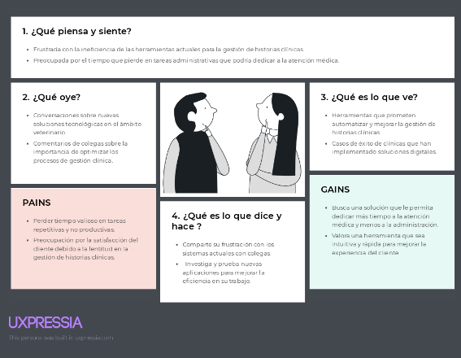
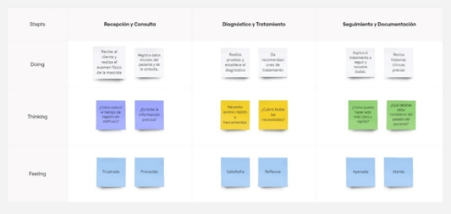
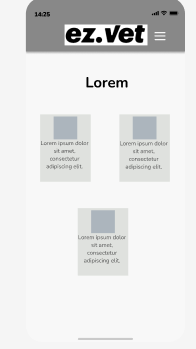
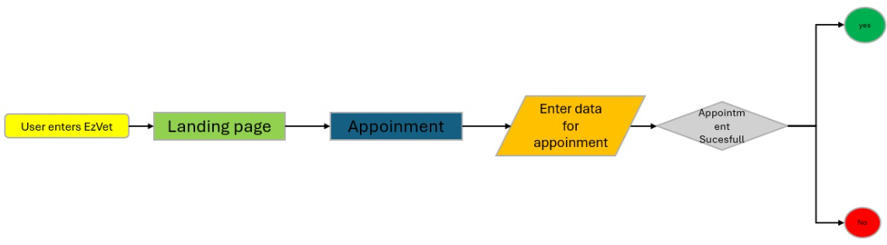

# COURSE PROJECT

---

<p align="center">
    <strong>Universidad Peruana de Ciencias Aplicadas (UPC)</strong><br>    
    </img><br>
    <strong>Carrera de Ingeniería de Software - Ciclo V</strong><br><br>
    <strong>Aplicacaiones Web - SI91</strong><br>
    <br><strong>Profesor: Alex Humberto Sánchez Ponce</strong><br>
    <br><strong><b>INFORME DEL TRABAJO FINAL</strong></b><br>
</p>

<p align="center">
    <strong>Startup del Proyecto: VetSolution</strong><br>
    <strong>Producto: "ez.vet"</strong><br>
</p>

<div>
    <h3 align="center">Team Members:</h3>
</div>

<div>
    <table align="center">
        <tr>
            <th style="text-align:center;">Member</th>
            <th style="text-align:center;">Code</th>
        </tr>
        <tr>
            <td>Bastidas Bastidas, Diego Martin</td>
            <td>U20221A301</td>
        </tr>
        <tr>
            <td>Bottger Salazar, Johan Karl</td>
            <td>U202210735</td>
        </tr>
        <tr>
            <td>De Las Casas Latour, Sebastián</td>
            <td>U202213553</td>
        </tr>
        <tr>
            <td>Escobar Palomino , Sebastian Matias</td>
            <td>u202125968</td>
        </tr>
        <tr>
            <td>Ticona Panduro, Estrella del Pilar</td>
            <td>U202210659</td>
        </tr>
    </table>
    </div>
</body>

<p align="center">
<br><strong>2024-02</strong></p>
<br>

  ## Historial de Versiones

<table>
<tr>
    <th colspan="3">Version</th>
    <th colspan="3">Fecha</th>
    <th colspan="10">Autores</td>
    <th colspan="5">Descripción de Modificaciones</td>
  <tr>
  <td colspan="3">1era</td>
    <td colspan="3">05/09/2024</td>
    <td colspan="10">Bastidas Bastidas Diego Martin, Bottger Salazar Johan Karl, De Las Casas Latour Sebastián, Escobar Palomino Sebastian Matias, Ticona Panduro Estrella del Pilar</td>
    <td colspan="5">Carátula, CapítuloI, Capítulo II, Capítulo III, Capítulo IV, Capítulo V, Landing page</td>
  </tr>
   <tr>
  <tr>
  <td colspan="3">2era</td>
    <td colspan="3">24/09/2024</td>
    <td colspan="10">Bastidas Bastidas Diego Martin, Bottger Salazar Johan Karl, De Las Casas Latour Sebastián, Escobar Palomino Sebastian Matias, Ticona Panduro Estrella del Pilar</td>
    <td colspan="5">Frond End</td>
  </tr> 
  <tr>
  <td colspan="3">3era</td>
    <td colspan="3">31/10/2024</td>
    <td colspan="10">Bastidas Bastidas Diego Martin, Bottger Salazar Johan Karl, De Las Casas Latour Sebastián, Escobar Palomino Sebastian Matias, Ticona Panduro Estrella del Pilar</td>
    <td colspan="5">Frond End - Back End</td>
  </tr> 
  </table>
  

  ## Project Report Collaboration Insights
  
  
A continuación, se detalla el proceso de elaboración del informe para cada entrega, junto con capturas de pantalla que muestran los análisis de colaboración y commits en GitHub para el repositorio del informe:

**URL del Repositorio del Informe:** <https://github.com/Ez-Vet> 

**Entrega N°1: TB1**
<br>
- Todos los miembros del equipo contribuyeron en la redacción del Informe. Se dividió en secciones específicas para cada capítulo, lo que permitió un mayor avance y equidad en el desarrollo del informe.

**Entrega N°2: TP**
<br>
- Todos los miembros del equipo contribuyeron en la redacción del Informe. Se dividió en secciones específicas, lo que permitió un mayor avance y equidad en el desarrollo del informe.
<br>

## Índice

- [Capítulo I: Introducción](https://github.com/Ez-Vet/VetSolution/blob/Chapter_1/README.md#capítulo-i-introducción)
  - [1.1. StartUp Profile](https://github.com/Ez-Vet/VetSolution/blob/Chapter_1/README.md#11-startup-profile)
    - [1.1.1. Descripción de la StartUp](https://github.com/Ez-Vet/VetSolution/blob/Chapter_1/README.md#111-descripción-de-la-startup)
    - [1.1.2. Perfiles de Integrantes del equipo](https://github.com/Ez-Vet/VetSolution/blob/Chapter_1/README.md#112-perfiles-de-integrantes-del-equipo)
  - [1.2. Solution Profile](https://github.com/Ez-Vet/VetSolution/blob/Chapter_1/README.md#12-solution-profile)
    - [1.2.1. Antecedentes y Problemática](https://github.com/Ez-Vet/VetSolution/blob/Chapter_1/README.md#121-antecedentes-y-problemática)
    - [1.2.2. Lean UX Process](https://github.com/Ez-Vet/VetSolution/blob/Chapter_1/README.md#122-lean-ux-process)
      - [1.2.2.1. Lean UX Problem Statements](https://github.com/Ez-Vet/VetSolution/blob/Chapter_1/README.md#1221-lean-ux-problem-statements)
      - [1.2.2.2. Lean UX Assumptions](https://github.com/Ez-Vet/VetSolution/blob/Chapter_1/README.md#1222-lean-ux-assumptions)
      - [1.2.2.3. Lean UX Hyphotesis Statements](https://github.com/Ez-Vet/VetSolution/blob/Chapter_1/README.md#1223-lean-ux-hyphotesis-statements)
      - [1.2.2.4. Lean UX Canvas](https://github.com/Ez-Vet/VetSolution/blob/Chapter_1/README.md#1224-lean-ux-canvas)
  - [1.3. Segmentos objetivo](https://github.com/Ez-Vet/VetSolution/blob/Chapter_1/README.md#13-segmentos-objetivo)
- [Capítulo II: Requirements Elicitation & Analysis](https://github.com/Ez-Vet/VetSolution/blob/Chapter_2/README.md#capítulo-ii-requirements-elicitation--analysis)
  - [2.1. Competidores](https://github.com/Ez-Vet/VetSolution/blob/Chapter_2/README.md#21-competidores)
    - [2.1.1 Análisis competitivo](https://github.com/Ez-Vet/VetSolution/blob/Chapter_2/README.md#211-análisis-competitivo)
    - [2.1.2. Estrategias y tácticas frente a competidores](https://github.com/Ez-Vet/VetSolution/blob/Chapter_2/README.md#212-estrategias-y-tácticas-frente-a-competidores)
  - [2.2. Entrevistas](https://github.com/Ez-Vet/VetSolution/blob/Chapter_2/README.md#22-entrevistas)
    - [2.2.1 Diseño de entrevistas](https://github.com/Ez-Vet/VetSolution/blob/Chapter_2/README.md#221-diseño-de-entrevistas)
    - [2.2.2. Registro de entrevistas](https://github.com/Ez-Vet/VetSolution/blob/Chapter_2/README.md#222-registro-de-entrevistas)
    - [2.2.3. Análisis de entrevistas](https://github.com/Ez-Vet/VetSolution/blob/Chapter_2/README.md#223-análisis-de-entrevistas)
  - [2.3. Needfinding](https://github.com/Ez-Vet/VetSolution/blob/Chapter_2/README.md#23-needfinding)
    - [2.3.1. User Persona](https://github.com/Ez-Vet/VetSolution/blob/Chapter_2/README.md#231-user-persona)
    - [2.3.2. User Task Matrix](https://github.com/Ez-Vet/VetSolution/blob/Chapter_2/README.md#232-user-task-matrix)
    - [2.3.3. User Journey Mapping](https://github.com/Ez-Vet/VetSolution/blob/Chapter_2/README.md#233-user-journey-mapping)
    - [2.3.4. Empathy Mapping](#234-empathy-mapping)
    - [2.3.5. As-is Scenario Mapping](#235-as-is-scenario-mapping)
    - [2.3.6. Ubiquitous Language](https://github.com/Ez-Vet/VetSolution/blob/Chapter_2/README.md#236-ubiquitous-language)
- [Capítulo III: Requirements Specification](https://github.com/Ez-Vet/VetSolution/blob/Chapter_3/README.md#capítulo-iii-requirements-specification)
  - [3.1. To-Be Scenario Mapping](https://github.com/Ez-Vet/VetSolution/blob/Chapter_3/README.md#31-to-be-scenario-mapping)
  - [3.2. User Stories](https://github.com/Ez-Vet/VetSolution/blob/Chapter_3/README.md#32-user-stories)
  - [3.3. Impact Mapping](https://github.com/Ez-Vet/VetSolution/blob/Chapter_3/README.md#33-impact-mapping)
  - [3.4. Product Backlog](https://github.com/Ez-Vet/VetSolution/blob/Chapter_3/README.md#34-product-backlog)
- [Capítulo IV: Product Design](https://github.com/Ez-Vet/VetSolution/blob/Chapter_4/README.md#capítulo-iv-product-design)
  - [4.1. Style Guidelines](https://github.com/Ez-Vet/VetSolution/blob/Chapter_4/README.md#41-style-guidelines)
    - [4.1.1. General Style Guidelines](https://github.com/Ez-Vet/VetSolution/blob/Chapter_4/README.md#411-general-style-guidelines)
    - [4.1.2. Web Style Guidelines](https://github.com/Ez-Vet/VetSolution/blob/Chapter_4/README.md#412-web-style-guidelines)
  - [4.2. Information Architecture](https://github.com/Ez-Vet/VetSolution/blob/Chapter_4/README.md#42-information-architecture)
    - [4.2.1. Organization Systems](https://github.com/Ez-Vet/VetSolution/blob/Chapter_4/README.md#421-organization-systems)
    - [4.2.2. Labeling Systems](https://github.com/Ez-Vet/VetSolution/blob/Chapter_4/README.md#422-labeling-systems)
    - [4.2.3. SEO Tags and Meta Tags](https://github.com/Ez-Vet/VetSolution/blob/Chapter_4/README.md#423-seo-tags-and-meta-tags)
    - [4.2.4. Searching Systems](https://github.com/Ez-Vet/VetSolution/blob/Chapter_4/README.md#424-searching-systems)
    - [4.2.5. Navigation Systems](https://github.com/Ez-Vet/VetSolution/blob/Chapter_4/README.md#425-navigation-systems)
  - [4.3. Landing Page UI Design](https://github.com/Ez-Vet/VetSolution/blob/Chapter_4/README.md#43-landing-page-ui-design)
    - [4.3.1. Landing Page Wireframe](https://github.com/Ez-Vet/VetSolution/blob/Chapter_4/README.md#431-landing-page-wireframe)
    - [4.3.2. Landing Page Mock-up](https://github.com/Ez-Vet/VetSolution/blob/Chapter_4/README.md#432-landing-page-mock-up)
  - [4.4. Web Applications UX/UI Design](https://github.com/Ez-Vet/VetSolution/blob/Chapter_4/README.md#44-web-applications-uxui-design)
    - [4.4.1. Web Applications Wireframes](https://github.com/Ez-Vet/VetSolution/blob/Chapter_4/README.md#441-web-applications-wireframes)
    - [4.4.2. Web Applications Wireflow Diagrams](https://github.com/Ez-Vet/VetSolution/blob/Chapter_4/README.md#442-web-applications-wireflow-diagrams)
    - [4.4.3. Web Applications Mock-ups](https://github.com/Ez-Vet/VetSolution/blob/Chapter_4/README.md#443-web-applications-mock-ups)
    - [4.4.4. Web Applications User Flow Diagrams](https://github.com/Ez-Vet/VetSolution/blob/Chapter_4/README.md#444-web-applications-user-flow-diagrams)
  - [4.5. Web Applications Prototyping](https://github.com/Ez-Vet/VetSolution/blob/Chapter_4/README.md#45-web-applications-prototyping)
  - [4.6. Domain-Driven Software Architecture](https://github.com/Ez-Vet/VetSolution/blob/Chapter_4/README.md#46-domain-driven-software-architecture)
    - [4.6.1. Software Architecture Context Diagram](https://github.com/Ez-Vet/VetSolution/blob/Chapter_4/README.md#461-software-architecture-context-diagram)
    - [4.6.2. Software Architecture Container Diagrams](https://github.com/Ez-Vet/VetSolution/blob/Chapter_4/README.md#462-software-architecture-container-diagrams)
    - [4.6.3. Software Architecture Components Diagrams](https://github.com/Ez-Vet/VetSolution/blob/Chapter_4/README.md#463-software-architecture-components-diagrams)
  - [4.7. Software Object-Oriented Design](https://github.com/Ez-Vet/VetSolution/blob/Chapter_4/README.md#47-software-object-oriented-design)
    - [4.7.1. Class Diagrams](https://github.com/Ez-Vet/VetSolution/blob/Chapter_4/README.md#471-class-diagrams)
    - [4.7.2. Class Dictionary](https://github.com/Ez-Vet/VetSolution/blob/Chapter_4/README.md#472-class-dictionary)
  - [4.8. Database Design](https://github.com/Ez-Vet/VetSolution/blob/Chapter_4/README.md#48-database-design)
    - [4.8.1. Database Diagram](https://github.com/Ez-Vet/VetSolution/blob/Chapter_4/README.md#481-database-diagram)
- [Capítulo V: Product Implementation, Validation & Deployment](https://github.com/Ez-Vet/VetSolution/blob/Chapter_5/README.md#capítulo-v-product-implementation-validation--deployment)
  - [5.1. Software Configuration Management](https://github.com/Ez-Vet/VetSolution/blob/Chapter_5/README.md#51-software-configuration-management)
    - [5.1.1. Software Development Environment Configuration](https://github.com/Ez-Vet/VetSolution/blob/Chapter_5/README.md#511-software-development-environment-configuration)
    - [5.1.2. Source Code Management](https://github.com/Ez-Vet/VetSolution/blob/Chapter_5/README.md#512-source-code-management)
    - [5.1.3. Source Code Style Guide & Conventions](https://github.com/Ez-Vet/VetSolution/blob/Chapter_5/README.md#513-source-code-style-guide--conventions)
    - [5.1.4. Software Deployment Configuration](https://github.com/Ez-Vet/VetSolution/blob/Chapter_5/README.md#514-software-deployment-configuration)
  - [5.2. Landing Page, Services & Applications Implementation](https://github.com/Ez-Vet/VetSolution/blob/Chapter_5/README.md#52-landing-page-services--applications-implementation)
    - [5.2.1. Sprint 1](https://github.com/Ez-Vet/VetSolution/blob/Chapter_5/README.md#521-sprint-1)
      - [5.2.1.1. Sprint Planning 1](https://github.com/Ez-Vet/VetSolution/blob/Chapter_5/README.md#5211-sprint-planning-1)
      - [5.2.1.2. Sprint Backlog 1](https://github.com/Ez-Vet/VetSolution/blob/Chapter_5/README.md#5212-sprint-backlog-1)
      - [5.2.1.3. Development Evidence for Sprint Review](https://github.com/Ez-Vet/VetSolution/blob/Chapter_5/README.md#5213-development-evidence-for-sprint-review)
      - [5.2.1.4. Testing Suite Evidence for Sprint Review](https://github.com/Ez-Vet/VetSolution/blob/Chapter_5/README.md#5214-testing-suite-evidence-for-sprint-review)
      - [5.2.1.5. Execution Evidence for Sprint Review](https://github.com/Ez-Vet/VetSolution/blob/Chapter_5/README.md#5215-execution-evidence-for-sprint-review)
      - [5.2.1.6. Services Documentation Evidence for Sprint Review](https://github.com/Ez-Vet/VetSolution/blob/Chapter_5/README.md#5216-services-documentation-evidence-for-sprint-review)
      - [5.2.1.7. Software Deployment Evidence for Sprint Review](https://github.com/Ez-Vet/VetSolution/blob/Chapter_5/README.md#5217-software-deployment-evidence-for-sprint-review)
      - [5.2.1.8. Team Collaboration Insights during Sprint](#5218-team-collaboration-insights-during-sprint)
  - [5.3. Validation Interviews](https://github.com/Ez-Vet/VetSolution/blob/Chapter_5/README.md#53-validation-interviews)
    - [5.3.1. Diseño de Entrevistas](https://github.com/Ez-Vet/VetSolution/blob/Chapter_5/README.md#531-diseño-de-entrevistas)
    - [5.3.2. Registro de Entrevistas](https://github.com/Ez-Vet/VetSolution/blob/Chapter_5/README.md#532-registro-de-entrevistas)
    - [5.3.3. Evaluaciones según heurísticas](https://github.com/Ez-Vet/VetSolution/blob/Chapter_5/README.md#533-evaluaciones-según-heurísticas)
  - [5.4. Video About-the-Product](https://github.com/Ez-Vet/VetSolution/blob/Chapter_5/README.md#54-video-about-the-product)
- [Conclusiones](https://github.com/Ez-Vet/VetSolution/blob/Chapter_5/README.md#conclusiones)
  - [Conclusiones y recomendaciones](https://github.com/Ez-Vet/VetSolution/blob/Chapter_5/README.md#conclusiones-y-recomendaciones)
  - [Video About-the-Team](https://github.com/Ez-Vet/VetSolution/blob/Chapter_5/README.md#video-about-the-team)
- [Bibliografía](https://github.com/Ez-Vet/VetSolution/blob/Chapter_5/README.md#bibliografía)
- [Anexos](https://github.com/Ez-Vet/VetSolution/blob/Chapter_5/README.md#anexos)


# Student Outcome
 Criterio Específico                                                                                                                                                                   | Acciones Realizadas                                                                                                                                                                                                                                                                                                                                                                                                                                                                                                                                                                                                                                                                                                                                                                                           | Conclusiones |
| ------------------------------------------------------------------------------------------------------------------------------------------------------------------------------------- | -------------------------------------- | ------------ |
| Comunica oralmente sus ideas y/o resultados con objetividad a público de diferentes especialidades y niveles jerarquicos, en el marco del desarrollo de un proyecto en ingeniería.    |**Bastidas Bastidas, Diego Martin** <br>**TB1:** En este entregable me encargue de desarrollar desde el capitulo 1 al capitulo  3 <br> **TP1:** En estre entregable me encargue de corregir el Product Backlog with User Stories y Sprint backlog. Además de realizar el feature/appointments<br> **TB2:** En este entregable me encargue de realizar las entrevistas de usuario y modificar el documento<br><br>**Bottger Salazar, Johan Karl**<br>**TB1:** En este entregable realice parte del Figma **TP1:** En este segundo entregable me encargue de realizar el feature/pet del frontend<br> **TB2:** <br><br>**De Las Casas Latour, Sebastián**<br> **TB1:** En este primer entregable me encargué del capitulo 5.1 y algunas partees del 5.2 <br>**TP1:** En este segundo entregable me encargue de realizar el feature/community del frontend<br> **TB2:**<br>En esta entrega me encargué de la creación de la base de datos MySQL en Azure<br> **Escobar Palomino, Sebastian Matias** <br> **TB1:** En este entregable desarrolle el Capítulo 4 (del 4.1al 4.4.2), Capítulo 5(del  5.2 hasta el 5.2.1.8) <br>**TP1:** En este segudo entregable me encrgue de realizar los routes de todas las brechas y realizar el feature/home y feature/contact<br> **TB2:**<br> <br>**Ticona Panduro, Estrella del Pilar** <br> **TB1:** En este primer entregable realice parte del capítulo 4, desde el 4.6 hasta el 4.8.1 <br>**TP1:** En este segundo entregable, realicé las correcciones del entregable pasado (capítulo IV) y creé las funcionalidades de login y register.<br> **TB2:** En este entregable corregi el frontend, agregando un nuevo repositorio, ademas de corregir el diseño en el capitulo 04 y deployar el front  |  **TB1:** <br>En esta primera etapa del proyecto, la comunicación efectiva ha jugado un papel crucial, ya que hemos tenido que manejar una cantidad considerable de contenido a presentar. Esto ha requerido de una planificación cuidadosa y una constante coordinación entre los miembros del equipo, permitiendo que cada uno pueda comprender su rol y las tareas asignadas. Además, la realización de reuniones periódicas en grupo no solo facilitó la colaboración, sino que también nos permitió detectar posibles obstáculos y encontrar soluciones de manera anticipada.<br><br> **TP1:** En esta segunda entrega parcial, la comunicación dentro del equipo ha sido fundamental para lograr desarrollar todas las funcionalidades clave del frontend de la aplicación web.<br><br> **TB2:** En esta tercera entrega, la coordinación fue importante para poder culmina de manera satisfactoria este entregable  |
| Comunica en forma escrita ideas y/o resultados con objetividad a público de diferentes especialidades y niveles jerarquicos, en el marco del desarrollo de un proyecto en ingeniería. | **Bastidas Bastidas, Diego Martin** <br> **TB1:** En este entregable me encargue de desarrollar desde el capitulo 1 al capitulo 3 <br> **TP1:** En estre entregable me encargue de corregir el Product Backlog with User Stories y Sprint backlog. Además de realizar el feature/appointments<br> **TB2:** <br><br>**Bottger Salazar, Johan Karl**<br>**TB1:** En este entregable realice parte del Figma **TP1:** En este segundo entregable me encargue de realizar el feature/pet del frontend<br> **TB2:**<br><br>**De Las Casas Latour, Sebastián**<br> **TB1:** En este primer entregable me encargué del capitulo 5.1 y algunas partees del 5.2<br> **TP1:** En este segundo entregable me encargue de realizar el feature/community del frontend<br> **TB2:**<br> En esta entrega se me confió con la responsabilidad de la creación de la base de datos en Microsoft Azure <br> **Escobar Palomino, Sebastian Matias** <br>En este entregable me encargue del Capítulo 4 (del 4.1al 4.4.2) Capítulo 5 del  5.2 hasta el 5.2.1.8 <br>**TP1:** En este segudo entregable me encrgue de realizar los routes de todas las brechas y realizar el feature/home y feature/contact<br> **TB2:** <br> <br>**Ticona Panduro, Estrella del Pilar** <br> **TB1:** En este primer entregable realice parte del capítulo 4, desde el 4.6 hasta el 4.8.1<br>**TP1:** En este segundo entregable, realicé las correcciones del entregable pasado (capítulo IV) y creé las funcionalidades de login y register<br> **TB2:** En este tercer entregable realice el front end y corregirlo, además de corregir el capitulo 4|   **TB1:** <br> Para esta entrega, se llevó a cabo un análisis exhaustivo de los principales competidores en el ámbito de las aplicaciones destinadas a la gestión del transporte terrestre. Asimismo, se consultó a personas vinculadas al sector, lo que permitió obtener una perspectiva clave que resultó muy útil para el desarrollo del proyecto. <br><br> **TP1:** En esta entrega del trabajo parcial, ha sido necesario utilizar los conocimientos obtenidos a partir de artefactos, como las entrevistas, para diseñar la solución de software correspondiente al frontend.<br><br> **TB2:** En este tercer entregable, fue necesario investigar en como deployar el front y que el api sea funciona, además de investigar para poder realizar el deploy del backend |


---

# <a name="_toc175363794"></a><a name="_toc176478894"></a>**1. Capítulo I: Introducción**
   ## <a name="_toc175363795"></a><a name="_toc176478895"></a>**1.1. Startup Profile**
  ### <a name="_toc175363796"></a><a name="_toc176478896"></a>**1.1.1. Descripción de la Startup**
"Ez.vet" es una plataforma completa diseñada para gestionar la administración veterinaria y visualizar historiales clínicos. Su principal propósito es simplificar y mejorar la gestión de diferentes aspectos del cuidado de mascotas, abarcando la administración de usuarios, clientes, productos, y servicios, así como la organización de los historiales clínicos. La meta es ofrecer una herramienta que ayude tanto a los dueños de mascotas como a los veterinarios en el manejo de la información y las tareas cotidianas.
### <a name="_toc175363797"></a><a name="_toc176478897"></a>**1.1.2. Perfiles de integrantes del equipo**

|                    Photo                        |                                                                                                                                                                                                                                                                                                    Description                                                                                                                                                                                                                                                                                                    |
| :------------------------------------------------: | :---------------------------------------------------------------------------------------------------------------------------------------------------------------------------------------------------------------------------------------------------------------------------------------------------------------------------------------------------------------------------------------------------------------------------------------------------------------------------------------------------------------------------------------------------------------------------------------------------------------: |
| Bastidas Bastidas, Diego Martin <br> |                                                                         Soy estudiante del 6to ciclo de la carrera de Ingeniería de Software. Decidí estudiar esta carrera porque desde pequeño me llamaba la atención el funcionamiento de una computadora y los procesos que conlleva. Me gusta practicar deportes de contacto, salir a pasear y sobre todo me encanta ser Groomer canino y trabajar con mascotas.                                                                                                                         |
| Bottger Salazar, Jhoan Karl   | Soy Johan Bottger, estoy en mi sexto ciclo de la carrera Ingeniería de Software en la UPC. Tengo conocimientos en los lenguajes C++, Python, JavaScript y HTML. Tengo gran interés en las metodologías ágiles por lo que en un futuro quisiera dedicarme a su implementación.                                                                         |
| De Las Casas Latour, Sebastian   | Mi nombre es Sebastián De Las Casas y tengo 20 años. Actualmente estoy cursando la carrera de Ingeniería de Software en la UPC. Me considero una persona paciente, optimista y que se maneja bien bajo presión. Como miembro del equipo me esforzaré en apoyar en todo lo que pueda al avance del trabajo. |
| Escobar Palomino, Sebastian Matias   |                                                                                                                              Como estudiante de ingeniería de software, me comprometo a contribuir al máximo en el grupo y a cumplir con las entregas dentro del plazo establecido, manteniendo una comunicación efectiva con mis compañeros y aplicando mis habilidades para desarrollar las tareas asignadas en este proyecto.                                                                                                                             |
|  Ticona Panduro, Estrella del Pilar     |                                                                                                                                                                                                actualmente estudio  la carrera de Ingeniería de Software en UPC. Opté por estudiar esta carrera porque me interesa programar y crear diferentes aplicativos o programas y emplearlo en la salud. En mis tiempos libres me gusta ver series o películas. Mi compromiso es aportar ideas innovadoras a lo largo del curso, en especial en las tareas en equipo. Mis habilidades son tener una actitud positiva, entusiasta y responsable.                                                                                                                                                                                                |


## <a name="_toc175363798"></a><a name="_toc176478898"></a>**1.2. Solution Profile**
Ez.vet es una aplicación creada específicamente para clínicas veterinarias, enfocada en la gestión interna de sus operaciones y en facilitar el acceso a la información clínica para los dueños de mascotas. Esta herramienta no solo permite a los veterinarios organizar y manejar de manera más eficiente los historiales clínicos de sus pacientes, sino que también ofrece funciones para gestionar recordatorios, controlar inventarios y realizar otras tareas cruciales para el funcionamiento de la clínica. 

La interfaz de Ez.vet está diseñada para ser intuitiva y fácil de usar, lo que facilita a los veterinarios llevar un control preciso y detallado de cada aspecto de su práctica sin complicaciones. Además, la aplicación incluye una función adicional que permite publicar los historiales clínicos para que los dueños de las mascotas puedan acceder a ellos en cualquier momento. Esto asegura que los propietarios estén siempre informados sobre la salud de sus mascotas y puedan consultar los detalles médicos cuando lo deseen, mejorando la comunicación y la transparencia entre la clínica y sus clientes.
### <a name="_toc175363799"></a><a name="_toc176478899"></a>**1.2.1. Antecedentes y problemática**
**What**

`		`**¿Cuál es el problema?**

`	`El problema reside en la falta de una aplicación que sea intuitiva y sencilla de usar en el entorno veterinario, y que, al mismo tiempo, permita integrar y gestionar de manera eficiente los diversos aspectos que involucra esta práctica.

**When**	

`		`**¿Cuándo sucede el problema?**

`	`El problema se presenta cuando las clínicas veterinarias no cuentan con una aplicación intuitiva y fácil de usar, lo que complica la integración y gestión eficiente de los distintos aspectos necesarios para su operación diaria.

**Where**

`		`**¿Dónde sucede el problema?**

`	`El problema se manifiesta en las clínicas veterinarias, donde la ausencia de una aplicación dificulta la integración y gestión de las diversas áreas esenciales para su funcionamiento. Esto no solo afecta el trabajo diario de los veterinarios, sino que también repercute en los dueños de mascotas, quienes requieren una forma sencilla de acceder a la información y los servicios relacionados con la salud de sus animales.

**Why**

`		`**¿Por qué sucede el problema?**	

`	`El problema radica en la falta de aplicaciones específicamente diseñadas para satisfacer las complejas y variadas necesidades de una clínica veterinaria. Aunque existen muchas aplicaciones, estas no son lo suficientemente flexibles o completas para cubrir todos los aspectos necesarios, como la gestión de historiales clínicos, el control de inventarios y la comunicación con los dueños de las mascotas. Esto genera dificultades tanto para los veterinarios, quienes se ven obligados a recurrir a múltiples herramientas o procesos manuales, como para los propietarios de mascotas, que enfrentan limitaciones en el acceso a información relevante.

**Who**

`		`**¿Qué llevara a las personas a usar nuestro producto?**

Las personas elegirán Ez.vet por la facilidad con la que podrán completar los campos requeridos, la amplia visibilidad que la aplicación tendrá en redes sociales, y, sobre todo, por lo sencillo que es llenar las historias clínicas sin la molestia de tener que cumplir con campos obligatorios.

**How**

`		`**¿En qué condiciones los clientes usaran nuestro producto?**

`	`Los clientes recurrirán a nuestro producto cuando necesiten una solución eficiente y fácil de usar para gestionar las operaciones de su clínica veterinaria. Esto abarca escenarios en los que buscan una herramienta que simplifique la administración de historiales clínicos, controle el inventario, y facilite la comunicación con los dueños de mascotas. Además, lo utilizarán cuando necesiten una aplicación que les permita acceder y compartir información médica de manera rápida y sin complicaciones, especialmente en un entorno donde el tiempo y la precisión son fundamentales.

**How Much**

` `Los clientes recurrirán a nuestro producto cuando necesiten una solución eficiente y fácil de usar para gestionar las operaciones de su clínica veterinaria. Esto abarca escenarios en los que buscan una herramienta que simplifique la administración de historiales clínicos, controle el inventario y facilite la comunicación con los dueños de mascotas. Además, lo utilizarán cuando necesiten una aplicación que les permita acceder y compartir información médica de manera rápida y sin complicaciones, especialmente en un entorno donde el tiempo y la precisión son fundamentales.
### ` `**<a name="_toc175363800"></a><a name="_toc176478900"></a>1.2.2. Lean UX Process**
  #### **1.2.2.1. Lean UX Problem Statements**
  La aplicación Ez.vet está diseñada para abordar la necesidad de una herramienta integral que simplifique la gestión diaria en las clínicas veterinarias. Con una interfaz intuitiva y fácil de usar, la aplicación busca eliminar las complicaciones y dificultades relacionadas con la administración de diversos aspectos de la práctica veterinaria en un solo lugar, permitiendo que tanto veterinarios como dueños de mascotas accedan de manera rápida y sencilla a la información relevante.

  #### **1.2.2.2. Lean UX Assumptions**
Sobre el producto:

1. ¿Quién es el usuario?

   Los usuarios principales de la aplicación son, por un lado, las clínicas veterinarias, que utilizan la plataforma para gestionar sus operaciones diarias, y por otro lado, los dueños de mascotas, quienes acceden fácilmente a la información médica y los servicios de la clínica.

1. ¿Dónde encaja la aplicación en su vida?

   La aplicación se incorpora en la rutina diaria de las clínicas veterinarias y en el cuidado diario de las mascotas, simplificando su tratamiento y atención.

1. ¿Qué problemas tienen nuestros usuarios y como se puede resolver?

   Los usuarios enfrentan la carencia de una aplicación especializada para la gestión completa de clínicas veterinarias y la falta de un portal accesible para consultar la historia clínica de una mascota. Nuestra aplicación aborda estos problemas al ofrecer una plataforma única que permite administrar todos los aspectos de la clínica y facilita el acceso a la información médica.

1. ¿Dónde y cuándo es usada nuestra aplicación?

   La aplicación se emplea principalmente en clínicas veterinarias. Los momentos clave para su uso incluyen durante las consultas veterinarias y cuando los dueños de mascotas optan por cambiar de veterinario y necesitan transferir el historial clínico o el registro de vacunas a una nueva clínica.

1. ¿Qué características son importantes?

   Las características clave abarcan una interfaz intuitiva que funcione en dispositivos móviles, computadoras y laptops. También es fundamental eliminar campos innecesarios u obligatorios que puedan complicar el proceso de registro.

1. ¿Cómo debe verse nuestra aplicación y como debe comportarse?

   Las características principales incluyen una interfaz fácil de usar en dispositivos móviles, computadoras y laptops. Además, es esencial eliminar campos innecesarios o obligatorios que puedan complicar el proceso de registro.

#### **1.2.2.3. Lean UX Hypothesis Statements**

  **Creemos** que si diseñamos una aplicación intuitiva que permita a los veterinarios gestionar historiales clínicos y recordatorios de manera eficiente

  **Sabremos** que hemos tenido éxito cuando observemos un aumento en la eficiencia operativa y una reducción en el tiempo dedicado a tareas administrativas en las clínicas veterinarias

  **Cuando** las clínicas adopten nuestra aplicación y reporten mejoras en su flujo de trabajo diario, habremos validado nuestra hipótesis.

  **Creemos** que al ofrecer una plataforma que facilite el acceso a la historia clínica de las mascotas para los dueños

  **Sabremos** que nuestra solución es efectiva cuando recibamos comentarios positivos de los usuarios sobre la facilidad de acceso y la utilidad de la información médica compartida

  **Cuando** los dueños de mascotas utilicen la aplicación para consultar y manejar la salud de sus animales sin problemas, habremos confirmado que estamos resolviendo una necesidad real

  **Creemos** que si eliminamos los campos obligatorios innecesarios y simplificamos el proceso de registro en la aplicación

  **Sabremos** que hemos logrado nuestro objetivo cuando los usuarios experimenten una mayor satisfacción y una reducción en los errores de entrada de datos

  **Cuando** tanto veterinarios como propietarios de mascotas reporten una experiencia de usuario fluida y sin frustraciones, habremos validado que nuestra aplicación cumple con las expectativas de simplicidad y funcionalidad.

#### **1.2.2.4. Lean UX Canvas**


## <a name="_toc175363801"></a><a name="_toc176478901"></a>**1.3. Segmentos Objetivos**
   ***Segmentos Objetivo 1 – Clínicas Veterinarias***

   Este segmento está compuesto por clínicas veterinarias de todos los tamaños, desde pequeñas prácticas hasta grandes centros veterinarios con múltiples especialistas. Las clínicas veterinarias modernas enfrentan la necesidad de mejorar la eficiencia en la gestión de sus operaciones diarias, ya que suelen manejar grandes volúmenes de información médica de distintas mascotas, además de gestionar inventarios, citas y relaciones con los dueños de las mascotas.

   Actualmente, muchas clínicas siguen utilizando métodos manuales, hojas de cálculo o sistemas de gestión que no están completamente adaptados a las necesidades del sector veterinario. Esto genera ineficiencias operativas que afectan la productividad del personal y la experiencia de los clientes, incrementando el tiempo de espera y los errores en la documentación.

   ***Segmentos Objetivo 2 – Dueño de Mascotas*** 

   Este segmento está formado por dueños de mascotas que buscan soluciones fáciles y convenientes para gestionar la salud de sus animales. Muchos de ellos son propietarios jóvenes y tecnológicos que ya están acostumbrados a utilizar aplicaciones móviles para gestionar varios aspectos de su vida diaria, y ven con buenos ojos el uso de herramientas digitales para el cuidado de sus mascotas. Sin embargo, también incluye a dueños de mascotas que pueden no estar tan familiarizados con la tecnología pero que buscan una forma más sencilla de gestionar toda la información relacionada con la salud de sus animales.


# <a name="_toc175363802"></a><a name="_toc176478902"></a>**2. Capítulo II: Requirements Elicitation & Analysis**
   ## <a name="_toc175363803"></a><a name="_toc176478903"></a>**2.1. Competidores**
**VetPraxis:** Es una solución de gestión para clínicas veterinarias, creada para mejorar la administración de las operaciones diarias. La aplicación incluye funcionalidades como la gestión de citas, historiales clínicos electrónicos, control de inventario y facturación. Además, ofrece herramientas para facilitar la comunicación con los clientes y el seguimiento de los tratamientos.

**VetApp:** Es una plataforma creada para gestionar clínicas veterinarias. Ofrece funciones como la programación de citas, la gestión de historiales clínicos electrónicos y la administración del inventario.

**PetClinic:** Es una aplicación desarrollada para la gestión de clínicas veterinarias y consultas para mascotas. Ofrece funciones para programar citas, gestionar historiales clínicos electrónicos, y administrar inventarios y facturación. La plataforma está diseñada para mejorar la organización y eficiencia en las clínicas, proporcionando herramientas para el seguimiento de tratamientos y la comunicación con los clientes. PetClinic está especialmente adaptada a las necesidades del sector veterinario en Perú.
### <a name="_toc175363804"></a><a name="_toc176478904"></a>**2.1.1. Análisis Competitivo** 

<table><tr><th colspan="6" valign="top"><b>Competitive Analysis Landscape</b></th></tr>
<tr><td rowspan="2" valign="top"><b>¿Por qué llevar a cabo este análisis?</b></td><td colspan="5" valign="top">Escriba en el recuadro la pregunta que busca responder o el objetivo de este análisis.</td></tr>
<tr><td colspan="5" valign="top">Para comparar las características tanto internas como externas de los productos que compiten con nosotros.</td></tr>
<tr><td colspan="2" valign="top">(En la cabecera colocar por cada competidor nombre y logo)</td><td>Ez.vet</td><td>VetPraxis</td><td>VetApp</td><td>PetClinic</td></tr>
<tr><td rowspan="2"><b>Perfil</b></td><td><b>Overview</b></td><td>Plataforma para clínicas veterinarias que facilita la gestión de historiales clínicos, recordatorios e inventarios mediante una interfaz intuitiva y sencilla de usar.</td><td>Software de gestión veterinaria que mejora la administración de citas, historiales clínicos y facturación a través de una interfaz amigable.</td><td>Aplicación móvil para la gestión de citas, recordatorios e historiales médicos de mascotas, que facilita la comunicación entre veterinarios y propietarios.</td><td>Plataforma que combina la administración de historiales clínicos, citas e inventario para optimizar la eficiencia en clínicas veterinarias.</td></tr>
<tr><td valign="top"><b>Ventaja competitiva ¿Qué valor ofrece a los clientes?</b></td><td>Interfaz fácil de usar que simplifica la gestión de historiales, recordatorios e inventarios.</td><td>Administración completa de citas, historiales y facturación mediante una interfaz amigable.</td><td>Gestión móvil de citas e historiales médicos que optimiza la comunicación entre veterinarios y propietarios.</td><td>Plataforma integral para gestionar historiales, citas e inventario en clínicas veterinarias.</td></tr>
<tr><td rowspan="2"><b>Perfil de Marketing</b></td><td valign="top"><b>Mercado objetivo</b></td><td>Clínicas veterinarias y dueños de mascotas</td><td>Clínicas veterinarias medianas y grandes</td><td>Propietarios de mascotas y veterinarios móviles</td><td>Clínicas veterinarias pequeñas y medianas</td></tr>
<tr><td valign="top"><b>Estrategias de marketing</b></td><td>Redes sociales y asociaciones con clínicas.</td><td>Estrategias de marketing de contenido y seminarios web.</td><td>Redes sociales</td><td>Publicidad dirigida y promociones</td></tr>
<tr><td rowspan="3"><b>Perfil de Producto</b></td><td valign="top"><b>Productos & Servicios</b></td><td>Administración de historiales clínicos, recordatorios e inventarios.</td><td>Gestión de citas, historiales clínicos y facturación</td><td>Aplicación móvil para gestionar citas e historiales médicos</td><td>Plataforma para administración de historiales, citas e inventario</td></tr>
<tr><td valign="top"><b>Precios & Costos</b></td><td>Suscripción mensual con diferentes niveles</td><td>Licencia de software con tarifas anuales</td><td>Descarga gratuita con compras dentro de la app</td><td>Suscripción con tarifas basadas en el tamaño de la clínica</td></tr>
<tr><td valign="top"><b>Canales de distribución (Web y/o Móvil)</b></td><td>Web y móvil</td><td>Web</td><td>Móvil (App stores)</td><td>Web</td></tr>
<tr><td rowspan="5"><b>Análisis SWOT</b></td><td colspan="5" valign="top">Realice esto para su startup y sus competidores. Sus fortalezas deberían apoyar sus oportunidades y contribuir a lo que ustedes definen como su posible ventaja competitiva.</td></tr>
<tr><td><b>Fortalezas</b></td><td>Interfaz intuitiva y fácil de usar; integración de múltiples funciones</td><td>Gestión integral y amigable; adaptado para clínicas medianas y grandes</td><td>Acceso móvil conveniente; mejora la comunicación con propietarios de mascotas</td><td>Plataforma integral para clínicas pequeñas y medianas; fácil de usar</td></tr>
<tr><td><b>Debilidades</b></td><td>Dependencia de la adopción por parte de clínicas veterinarias</td><td>Costos potencialmente altos para pequeñas clínicas</td><td>Funcionalidades limitadas comparadas con plataformas completas</td><td>Limitado a clínicas de menor tamaño; menos atractivo para grandes clínicas</td></tr>
<tr><td><b>Oportunidades</b></td><td>Expansión en el mercado de clínicas veterinarias pequeñas y medianas</td><td>Crecimiento en el segmento de clínicas grandes y asociaciones veterinarias</td><td>Expansión en el mercado de usuarios móviles y propietarios de mascotas</td><td>Penetración en el mercado de clínicas veterinarias pequeñas</td></tr>
<tr><td><b>Amenazas</b></td><td>Competencia de otras plataformas con características similares</td><td>Competencia con soluciones de bajo costo o gratuitas</td><td>Alta competencia en aplicaciones móviles para la salud de mascotas</td><td>Competencia de soluciones más avanzadas para clínicas grandes</td></tr>
</table>


### <a name="_toc175363805"></a><a name="_toc176478905"></a>**2.1.2. Estrategias y tácticas frente a competidores**

Estrategias: 

Para destacar en el mercado, Ez.vet se enfocará en ofrecer una interfaz excepcionalmente intuitiva y fácil de usar, diferenciándose de las soluciones más complejas y difíciles de manejar. Además, se distinguirá por su valor añadido al incluir características exclusivas, como la personalización de historiales clínicos y recordatorios adaptados a las necesidades particulares de cada clínica y propietario de mascotas.

Tácticas: 

- Se llevarán a cabo demostraciones personalizadas en clínicas veterinarias para mostrar de forma práctica las ventajas de la plataforma. Asimismo, se ofrecerán períodos de prueba gratuita para que los usuarios puedan experimentar los beneficios de Ez.vet sin ningún compromiso.

- Se recogerán y publicarán testimonios y casos de éxito de usuarios satisfechos que hayan logrado mejoras significativas en la gestión veterinaria. Estos testimonios se emplearán en campañas de marketing y en el sitio web de la aplicación para fortalecer la credibilidad y atraer nuevos clientes.


## <a name="_toc175363806"></a><a name="_toc176478906"></a>**2.2. Entrevistas**
   ### <a name="_toc175363807"></a><a name="_toc176478907"></a>**2.2.1. Diseño de Entrevistas**
  ***Segmento 1: Médicos Veterinarios***

1. ¿Conoces alguna aplicación de gestión veterinaria? ¿Cuál es?
1. ¿Lo escogieron por alguna razón es especial?
1. ¿Fue la primera aplicación que usaron?
1. ¿Qué es lo que te gusta de esa aplicación?
1. ¿Qué te disgusta de esa aplicación?
1. ¿Qué sería una de las cosas que si o si cambiarias?

***Segmento 2: Dueños de Mascotas***

1. ¿Con que frecuencia vas al veterinario?
1. ¿Qué método usas para llevar el control de tu mascota?
1. ¿Alguna vez perdiste los documentos?
1. ¿En medio de algún tratamiento cambiaste de veterinario?
1. ¿Qué opinas de tener la historia clínica en una aplicación?
1. ¿Usarías una aplicación como la descrita?
### <a name="_toc175363808"></a><a name="_toc176478908"></a>**2.2.2. Registro de entrevistas**
   ***Segmento 1: Médicos Veterinarios***

   **Entrevistado N°1: Jasmin Flores**

- **Sexo: Femenino** 
- **Edad: 26**
- **Domicilio: San Miguel** 

**Entrevista:** 

- <a name="_hlk176441569"></a>**Link: <https://upcedupe-my.sharepoint.com/:v:/g/personal/u20221a301_upc_edu_pe/EQ-ZYy2RvYpNgt1Qfy9tHTUByB1wTz3kGVrQscVWHWam9A?nav=eyJyZWZlcnJhbEluZm8iOnsicmVmZXJyYWxBcHAiOiJPbmVEcml2ZUZvckJ1c2luZXNzIiwicmVmZXJyYWxBcHBQbGF0Zm9ybSI6IldlYiIsInJlZmVycmFsTW9kZSI6InZpZXciLCJyZWZlcnJhbFZpZXciOiJNeUZpbGVzTGlua0NvcHkifX0&e=j1mdQ7>** 
- **Momento en el que Inicia: 0:00 min**
- **Duración: 4:49 min**

**Resumen:**

La doctora Jasmín nos comenta que en la veterinaria donde trabaja, solo tienen un usuario que se puede abrir en varios dispositivos para completar las historias clínicas. Lo que le agrada de esta aplicación es que está diseñada específicamente para el trabajo en veterinarias, con campos adaptados a cada especie o raza. Sin embargo, lo que no le gusta es que, aunque algunos campos no son obligatorios, tener que pasarlos para completar la historia clínica toma más tiempo del que desearía.


**Entrevistado N°2: Erick Monzón**

- **Sexo: Masculino** 
- **Edad: 30**
- **Domicilio: Magdalena del Mar** 

**Entrevista:** 

- **Link: <https://upcedupe-my.sharepoint.com/:v:/g/personal/u20221a301_upc_edu_pe/EbCW9J6OzTFKoDAHzGbfWzEBpDcpUG7M16WiUuDkC7iPMA>** 
- **Momento en el que Inicia: 0:00 min**
- **Duración: 6:22 min**

**Resumen:**

El Doctor Erick nos comenta que en su trabajo utilizan VetPraxis, principalmente porque es una aplicación muy reconocida y muchas veterinarias la emplean. Sin embargo, señala que tiene ciertas deficiencias, especialmente en lo que respecta a la eficiencia. Una de las principales críticas que hace es la inclusión de numerosos campos obligatorios que considera innecesarios, como el teléfono de trabajo, RUC, enlaces a redes sociales como Facebook e Instagram, y otros detalles que realmente no son relevantes para la atención al cliente. Esto se traduce en un proceso de creación de historias clínicas que puede tomar entre 7 y 10 minutos, un tiempo excesivo, especialmente en situaciones de emergencia donde la rapidez es crucial. Erick enfatiza que uno de los cambios que realizaría de manera prioritaria sería la eliminación de estos campos superfluos, para agilizar el proceso y hacer la aplicación más eficiente.  


**Entrevistado N°3: Vanesa Gómez** 

- **Sexo: Femenino**
- **Edad: 25**
- **Domicilio: Lince** 

**Entrevista:** 

- **Link: <https://upcedupe-my.sharepoint.com/:v:/g/personal/u20221a301_upc_edu_pe/EYY7QpIHFxlDh0ksAmySO-kB1yHNDLGTJPHi61WTR0jlWg?nav=eyJyZWZlcnJhbEluZm8iOnsicmVmZXJyYWxBcHAiOiJPbmVEcml2ZUZvckJ1c2luZXNzIiwicmVmZXJyYWxBcHBQbGF0Zm9ybSI6IldlYiIsInJlZmVycmFsTW9kZSI6InZpZXciLCJyZWZlcnJhbFZpZXciOiJNeUZpbGVzTGlua0NvcHkifX0&e=JeOE4m>** 
- **Momento en el que Inicia:**
- **Duración: 6:58 min**

**Resumen:**

La doctora Vanesa comenta que en su trabajo actual utilizan VetPraxis, principalmente porque es la aplicación más conocida entre las veterinarias. Sin embargo, en su trabajo anterior, usaban fichas en papel, que luego archivaban en un Excel donde guardaban el número de historia clínica y el nombre de la mascota para facilitar la búsqueda posterior. Al igual que el doctor Erick, Vanesa no está satisfecha con los campos innecesarios que VetPraxis requiere, ya que le toma entre 10 y 15 minutos crear una historia clínica, lo cual considera excesivo. En su anterior trabajo, también encontraba ineficiente el método físico, ya que la letra a veces no era legible o las historias se traspapelaban, lo que causaba molestias a los clientes. Vanesa cambiaría estos campos innecesarios que ralentizan el proceso de creación de historias clínicas en VetPraxis.


***Segmento 2: Dueños de Mascotas***

**Entrevistado N°1: Sebastián Silva**

- **Sexo: Masculino**
- **Edad: 20**
- **Domicilio: San Luis** 

**Entrevista:** 

- **Link: <https://upcedupe-my.sharepoint.com/:v:/g/personal/u20221a301_upc_edu_pe/Ec1XInM48xNOvR2jbzHkwuABf9CG5aosdZClZOwqh0nyYw>** 
- **Momento en el que Inicia: 0:00 min**
- **Duración: 6:58 min**

**Resumen:**

`	`Sebastián nos comenta que lleva a su mascota al veterinario entre una y dos veces al año, aunque si su gato presentara algún malestar, lo llevaría con mayor frecuencia. Con su perro, solía ir una vez a la semana debido a una infección en el oído. Sebastián mencionó que no recuerda dónde dejó la carpeta con toda la documentación médica de su mascota y que le gustaría tener una aplicación donde pudiera almacenar todo el historial médico de sus mascotas. De esta manera, podría actuar más rápidamente en caso de una emergencia, ya que tendría la información disponible en su celular. A pesar de esto, seguiría utilizando el formato físico como respaldo para no perder ningún registro de las atenciones a sus mascotas.


**Entrevistado N°2: Lucerito Guzmán**

- **Sexo: Femenino** 
- **Edad: 22 años**
- **Domicilio: Callao**

**Entrevista:** 

- **Link: <a name="_hlk176441682"></a><https://upcedupe-my.sharepoint.com/:v:/g/personal/u20221a301_upc_edu_pe/EQxyGm-xOy9Gixk9iwdU5-4B7_sjaOllyMTn6QX3f6py1Q?nav=eyJyZWZlcnJhbEluZm8iOnsicmVmZXJyYWxBcHAiOiJPbmVEcml2ZUZvckJ1c2luZXNzIiwicmVmZXJyYWxBcHBQbGF0Zm9ybSI6IldlYiIsInJlZmVycmFsTW9kZSI6InZpZXciLCJyZWZlcnJhbFZpZXciOiJNeUZpbGVzTGlua0NvcHkifX0&e=aOWtoD>** 
- **Momento en el que Inicia: 0:00 min**
- **Duración: 7:10 min**	

**Resumen:**

`	`Lucerito nos comenta que visita al veterinario con bastante regularidad: una vez cada tres meses por su gata pequeña y una vez al mes para bañar a su perra. Ha tenido problemas con la pérdida de cartillas de vacunación, exámenes y otros documentos relacionados con sus gatas adultas. Además, ha cambiado de veterinaria en dos o tres ocasiones por diferentes razones, lo que le ha generado confusión sobre los productos utilizados en el baño de su perra y la marca de las vacunas administradas. Por estos motivos, está totalmente a favor de utilizar una aplicación como ez.vet, ya que le facilitaría acceder a la historia clínica de sus mascotas.


**Entrevistado N°3:**

- **Sexo: Femenino**
- **Edad:19**
- **Domicilio: Surco** 

**Entrevista:** 

- **Link: https://upcedupe-my.sharepoint.com/:v:/g/personal/u20221a301_upc_edu_pe/EdLeJQNC0zlOtk2xPH342PgBlev9nHaaM7CVIZbloEn-cg?nav=eyJyZWZlcnJhbEluZm8iOnsicmVmZXJyYWxBcHAiOiJPbmVEcml2ZUZvckJ1c2luZXNzIiwicmVmZXJyYWxBcHBQbGF0Zm9ybSI6IldlYiIsInJlZmVycmFsTW9kZSI6InZpZXciLCJyZWZlcnJhbFZpZXciOiJNeUZpbGVzTGlua0NvcHkifX0&e=3m9TdR**
- **Momento en el que Inicia: 0:00 min**
- **Duración: 2:34 min**

**Resumen:**

`	`Camila nos cuenta que tiene un gatito y lo lleva al veterinario cada seis meses para chequeos regulares. Si su mascota se enferma, acude con mayor frecuencia. Hasta ahora, no ha perdido su cartilla de vacunación, aunque reconoce que podría ocurrir en el futuro. Ella ha cambiado de veterinaria, y en ese proceso le pidieron nuevamente los exámenes que ya había realizado. Al no contar con los resultados, tuvo que repetirlos. Camila considera excelente la idea de una aplicación como la descrita, ya que le permitiría mantener todo más organizado y reducir las posibilidades de perder la cartilla o los exámenes.


### <a name="_toc175363809"></a><a name="_toc176478909"></a>**2.2.3. Análisis de Entrevistas**
   ***Segmento 1: Médicos Veterinarios***

- El 100% de los entrevistados utilizan software de gestión en sus clínicas veterinarias. Dos de ellos (66.7%) emplean VetPraxis debido a su reconocimiento en el mercado, mientras que uno (33.3%) utiliza otro software específico para veterinarias.
- El 100% de los veterinarios expresaron preocupaciones sobre el tiempo que toma completar las historias clínicas. El 66.7% de ellos reportaron que el proceso puede tomar entre 7 y 15 minutos, lo cual consideran excesivo. Esto destaca la necesidad de soluciones más eficientes.
- El 100% de los entrevistados mencionaron insatisfacción con la eficiencia del software que utilizan. Todos ellos señalaron la presencia de campos innecesarios que complican el proceso de creación de historias clínicas.
- El 33.3% de los entrevistados aprecian que el software esté adaptado a las necesidades específicas de las veterinarias, con campos diseñados para cada especie o raza. Sin embargo, incluso en estos casos, la eficiencia sigue siendo una preocupación.

***Segmento 2: Dueños de Mascotas***

- El 50% de los entrevistados lleva a su mascota al veterinario entre una y dos veces al año, aunque la frecuencia podría aumentar si su mascota presentara algún problema de salud. El otro 50% visita al veterinario regularmente, con una frecuencia de una vez cada tres meses para su gata y una vez al mes para el baño de su perra.
- El 100% de los entrevistados han enfrentado dificultades para localizar o mantener organizados los documentos médicos de sus mascotas. Uno de ellos no recuerda dónde guardó la carpeta con la documentación médica, mientras que el otro ha perdido cartillas de vacunación y exámenes en más de una ocasión.
- El 100% de los entrevistados mostraron interés en utilizar una aplicación móvil para gestionar la información médica de sus mascotas. Consideran que tener acceso digital al historial médico facilitaría las visitas al veterinario y mejoraría la respuesta en caso de emergencias.

## <a name="_toc175363810"></a><a name="_toc176478910"></a>**2.3. Needfinding**
   ### <a name="_toc175363811"></a><a name="_toc176478911"></a>**2.3.1. User Personas**    ***Segmento 1: Médicos Veterinarios***

  

  ***Segmento 2: Dueños de Mascotas***

  
  ### <a name="_toc175363813"></a><a name="_toc176478912"></a>**2.3.2. User Task Matrix**
  ***Segmento 1: Médicos Veterinarios***

|**Vanesa Gómez Suarez**|||
| :-: | :- | :- |
|**Actividades**|**Frecuencia**|**Importancia**|
|Crear y actualizar historias clínicas de pacientes	|Alta|Alta|
|Completar campos necesarios en el software	|Alta|Alta|
|Acceder y buscar historiales clínicos de mascotas	|Alta|Alta|
|Programar y gestionar citas veterinarias	|Media|Alta|
|Archivar y organizar documentación médica|Media|Media|
|Resolver problemas de legibilidad y traspaleo de documentos|Media|Alta|
|Mejorar la eficiencia del proceso de documentación|Media|Alta|
|Atender a clientes de manera rápida y eficiente|Alta|Alta|

***Segmento 2: Dueños de Mascotas***

|**Lucerito Guzmán León**|||
| :-: | :- | :- |
|**Actividades**|**Frecuencia**|**Importancia**|
|Llevar a sus mascotas al veterinario|Alta|Alta|
|Programar y gestionar citas veterinarias|Alta|Alta|
|Mantener y organizar documentación médica de sus mascotas|Alta|Alta|
|Buscar historiales clínicos de sus mascotas|Media|Alta|
|Cambiar de veterinaria cuando sea necesario|Baja|Media|
|Actuar rápidamente en emergencias médicas|Media|Alta|
|Almacenar y respaldar información médica digital y física|Alta|Alta|

### <a name="_toc175363814"></a><a name="_toc176478913"></a>**2.3.3. User Journey Mapping**
   ***Segmento 1: Médicos Veterinarios***

   


   ***Segmento 2: Dueños de mascotas***

   

### <a name="_toc175363815"></a><a name="_toc176478914"></a>**2.3.4. Empathy Mapping**
   ***Segmento 1: Médicos Veterinarios***

   

   ***Segmento 2: Dueños de mascotas***

   

### <a name="_toc175363816"></a><a name="_toc176478915"></a>**2.3.5. As-is Scenario Mapping**
   ***Segmento 1: Médicos Veterinarios***

   

   ***Segmento 2: Dueños de Mascotas***

   
## <a name="_toc175363817"></a><a name="_toc176478916"></a>**2.4. Ubiquitous Language**
Este glosario proporciona definiciones claras y precisas de términos específicos al dominio veterinario, facilitando la comunicación entre todos los miembros del equipo y los stakeholders. El objetivo es evitar malentendidos y asegurar que todos compartan una comprensión común de los conceptos clave en el proyecto.

**Términos del Glosario**

- **Vaccination Schedule (Calendario de Vacunación):**
  Plan que establece las fechas y tipos de vacunas que debe recibir un animal para mantener su salud.
- **Parasite Control (Control de Parásitos):**
  Estrategias y tratamientos utilizados para prevenir o eliminar parásitos internos y externos en los animales.
- **Nutritional Assessment (Evaluación Nutricional):**
  Evaluación del estado nutricional de un paciente para ajustar su dieta según sus necesidades de salud.
- **Behavioral Consultation (Consulta de Comportamiento):**
  Sesión en la que el veterinario asesora sobre problemas de comportamiento en mascotas, ofreciendo estrategias para corregir conductas indeseadas.
- **Spaying/Neutering (Esterilización/Castración):**
  Procedimiento quirúrgico realizado para prevenir la reproducción en animales, eliminando los órganos reproductivos.
- **Microchipping (Microchip):**
  Técnica para insertar un microchip bajo la piel de una mascota, permitiendo su identificación en caso de pérdida.
- **Health Certificate (Certificado de Salud):**
  Documento oficial emitido por un veterinario que certifica la buena salud de un animal, requerido para viajes o adopciones.
- **Euthanasia (Eutanasia):**
  Procedimiento para poner fin de manera compasiva y sin dolor a la vida de un animal que sufre de una enfermedad terminal o grave.
- **Dental Prophylaxis (Profilaxis Dental):**
  Procedimiento de limpieza dental para prevenir enfermedades en los dientes y encías de los animales.
- **Routine Check-up (Revisión de Rutina):**
  Examen regular realizado por un veterinario para monitorear la salud general del animal y detectar problemas tempranos.

# <a name="_toc176478917"></a><a name="_hlk176118348"></a>**3. Capítulo III: Requirements Specification**
   ## <a name="_toc176478918"></a>**3.1. To-Be Scenario Mapping**

  ***Segmento 1: Médicos Veterinarios***

  

  ***Segmento 2: Dueños de Mascotas***

  


   ## <a name="_toc176169123"></a><a name="_toc176478919"></a>**3.2. User Stories**

|<p>**Epic / Story**</p><p>**ID**</p>|**Título**|**Descripción**|<p>**Criterios de**</p><p>**Aceptación**</p>|<p>**Relacionado**</p><p>**con (Epic ID)**</p>|
| :-: | :-: | :-: | :-: | :-: |
|**EP001**|Registro de Usuario|Como usuario nuevo, deseo registrarme en la plataforma para acceder a las funcionalidades del sistema|<p>**Escenario 1:**<br>**Dado** que soy un usuario nuevo,<br>**Cuando** ingreso mis datos correctos,<br>**Entonces** el sistema debería registrarme y enviarme un correo de confirmación.</p><p></p>|N/A|
|**EP002**|Gestión de Mascotas|Como usuario, deseo gestionar las mascotas bajo mi cuidado para mantener su información actualizada|**Escenario 1:**<br>**Dado** que soy un usuario registrado,<br>**Cuando** añado una nueva mascota,<br>**Entonces** debería poder guardar sus detalles y ver la información en mi perfil.|N/A|
|**EP003**|Notificaciones|Como usuario, deseo recibir notificaciones para estar al tanto de eventos importantes|<p>**Escenario 1:**<br>**Dado** que soy un usuario registrado,<br>**Cuando** se acerca una cita programada,<br>**Entonces** debería recibir una notificación de recordatorio.</p><p></p>|N/A|
|**EP004**|Gestión de Perfil|Como usuario, deseo gestionar mi perfil para mantener mi información personal actualizada|<p>**Escenario 1:**<br>**Dado** que soy un usuario registrado,<br>**Cuando** edito mis datos personales,<br>**Entonces** debería poder actualizar y guardar los cambios.</p><p></p>|N/A|
|**EP005**|Administración del Backend|Como desarrollador, deseo administrar el backend del sistema para garantizar el correcto funcionamiento|<p>**Escenario 1:**<br>**Dado** que soy un desarrollador,<br>**Cuando** realizo un cambio en la base de datos,<br>**Entonces** debería verificar que todas las dependencias se actualicen correctamente.</p><p></p>|N/A|
|**US001**|Inicio de Sesión|Como usuario registrado, deseo iniciar sesión para acceder a mi cuenta|<p>**Escenario 1:**<br>**Dado** que soy un usuario registrado,<br>**Cuando** ingreso mis credenciales correctas,<br>**Entonces** debería acceder a mi cuenta.</p><p>**Escenario 2:**<br>**Dado** que soy un usuario registrado,<br>**Cuando** ingreso credenciales incorrectas,<br>**Entonces** debería ver un mensaje de error indicando credenciales inválidas.</p>|EP001|
|**US002**|Recuperación de Contraseña|Como usuario, deseo recuperar mi contraseña para acceder a mi cuenta si la olvido|<p>**Escenario 1:**<br>**Dado** que olvidé mi contraseña,<br>**Cuando** ingreso mi correo registrado,<br>**Entonces** debería recibir un correo con un enlace para restablecerla.</p><p>**Escenario 2:**<br>**Dado** que ingresé un correo no registrado,<br>**Cuando** intento recuperar mi contraseña,<br>**Entonces** debería ver un mensaje de error indicando que el correo no existe.</p>|EP001|
|**US003**|Visualización de Historia Clínica|Como usuario, deseo visualizar la historia clínica de mis mascotas para revisar su historial médico|<p>**Escenario 1:**<br>**Dado** que soy un usuario registrado,<br>**Cuando** selecciono una mascota,<br>**Entonces** debería poder ver su historia clínica completa.</p><p>**Escenario 2:**<br>**Dado** que soy un usuario registrado,<br>**Cuando** no hay historial disponible,<br>**Entonces** debería ver un mensaje indicando que no hay información médica aún.</p>|EP002|
|**US004**|Agendamiento de Citas|Como usuario, deseo agendar citas veterinarias para organizar la atención de mis mascotas|<p>**Escenario 1:**<br>**Dado** que soy un usuario registrado,<br>**Cuando** elijo una fecha y hora,<br>**Entonces** debería poder confirmar y agendar la cita.</p><p>**Escenario 2:**<br>**Dado** que soy un usuario registrado,<br>**Cuando** intento agendar una cita en un horario no disponible,<br>**Entonces** debería ver un mensaje indicando la indisponibilidad.</p>|EP002|
|**US005**|Personalización de Notificaciones|Como usuario, deseo personalizar las notificaciones para recibir solo la información relevante|<p>**Escenario 1:**<br>**Dado** que soy un usuario registrado,<br>**Cuando** configuro las notificaciones,<br>**Entonces** debería poder elegir qué tipo de alertas deseo recibir.</p><p>**Escenario 2:**<br>**Dado** que soy un usuario registrado,<br>**Cuando** desactivo las notificaciones,<br>**Entonces** no debería recibir ninguna alerta hasta que las reactive.</p>|EP003|
|**US006**|Consulta de Servicios Veterinarios|Como usuario, deseo consultar los servicios veterinarios disponibles para seleccionar el adecuado|<p>**Escenario 1:**<br>**Dado** que soy un usuario registrado,<br>**Cuando** navego por los servicios,<br>**Entonces** debería poder ver una lista detallada de los mismos.</p><p>**Escenario 2:**<br>**Dado** que soy un usuario registrado,<br>**Cuando** selecciono un servicio específico,<br>**Entonces** debería ver los detalles y costos asociados.</p>|EP002|
|**US007**|Visualización de Historial de Citas|Como usuario, deseo visualizar mi historial de citas para hacer seguimiento de las visitas anteriores|**Escenario 1:**<br>**Dado** que soy un usuario registrado,<br>**Cuando** accedo a mi historial de citas,<br>**Entonces** debería poder ver todas las citas anteriores con sus detalles.**Escenario 2:**<br>**Dado** que soy un usuario registrado,<br>**Cuando** no tengo citas anteriores,<br>**Entonces** debería ver un mensaje indicando que no hay citas en el historial.|EP004|
|**US008**|Contacto con el Veterinario|Como usuario, deseo contactar al veterinario para hacer preguntas o recibir asesoría|<p>**Escenario 1:**<br>**Dado** que soy un usuario registrado,<br>**Cuando** uso la función de contacto,<br>**Entonces** debería poder enviar un mensaje directamente al veterinario.</p><p>**Escenario 2:**<br>**Dado** que soy un usuario registrado,<br>**Cuando** no hay un veterinario disponible,<br>**Entonces** debería ver un mensaje indicando la falta de disponibilidad.</p>|EP002|
|**US009**|Acceso al Foro de la Comunidad|Como usuario, deseo acceder a un foro comunitario para interactuar con otros dueños de mascotas|<p>**Escenario 1:**<br>**Dado** que soy un usuario registrado,<br>**Cuando** entro al foro,<br>**Entonces** debería poder leer y publicar mensajes en las discusiones.</p><p>**Escenario 2:**<br>**Dado** que soy un usuario registrado,<br>**Cuando** un mensaje viola las reglas del foro,<br>**Entonces** debería poder reportarlo a los moderadores.</p>|EP003|
|**US010**|Implementación de API RESTful|Como desarrollador, deseo implementar un API RESTful para la comunicación entre el frontend y backend|**Escenario 1:**<br>**Dado** que soy un desarrollador,<br>**Cuando** realizo un request de tipo GET,<br>**Entonces** debería recibir los datos solicitados en formato JSON.<br><br>**Escenario 2:**<br>**Dado** que soy un desarrollador,<br>**Cuando** realizo un request de tipo POST con datos válidos,<br>**Entonces** debería poder guardar la información en la base de datos|EP005|
|**US011**|Monitorización de la Salud del Sistema|Como desarrollador, deseo monitorizar la salud del sistema para detectar problemas tempranos|<p>**Escenario 1:**<br>**Dado** que soy un desarrollador,<br>**Cuando** implemento un sistema de monitoreo,<br>**Entonces** debería recibir alertas automáticas en caso de fallas.</p><p>**Escenario 2:**<br>**Dado** que soy un desarrollador,<br>**Cuando** reviso los logs del sistema,<br>**Entonces** debería poder identificar y resolver problemas de rendimiento.</p>|EP005|
|**US012**|Landing Page|Como visitante, deseo ver la información en la Landing Page para conocer los servicios ofrecidos|<p>**Escenario 1:**<br>**Dado** que soy un visitante,<br>**Cuando** ingreso al sitio web,<br>**Entonces** debería ver una presentación clara de los servicios ofrecidos en la Landing Page.</p><p>**Escenario 2:**<br>**Dado** que soy un visitante,<br>**Cuando** hago clic en un servicio específico,<br>**Entonces** debería ser dirigido a una página con más detalles sobre ese servicio.</p>|N/A|
|**US013**|Contacto a través de la Landing Page|Como visitante, deseo contactar al equipo para obtener más información sobre los servicios|<p>**Escenario 1:**<br>**Dado** que soy un visitante,<br>**Cuando** lleno el formulario de contacto,<br>**Entonces** debería recibir una confirmación de que el mensaje fue enviado correctamente.</p><p>**Escenario 2:**<br>**Dado** que soy un visitante,<br>**Cuando** no completo todos los campos obligatorios del formulario,<br>**Entonces** debería ver un mensaje de error solicitando completar la información.</p>|US012|

## **<a name="_toc176478920"></a>3.3. Impact Mapping**


## <a name="_toc176169125"></a><a name="_toc176478921"></a>**3.4. Product Backlog**

|# Orden|User Story Id|Título|Descripción|<p>Story Points</p><p>(1 / 2 / 3 / 5</p><p>/ 8)</p>|
| :-: | :-: | :-: | :-: | :-: |
|1|US012|Landing Page|Como visitante, deseo ver la información en la Landing Page para conocer los servicios ofrecidos.|3|
|2|US013|Contacto a través de la Landing Page|Como visitante, deseo contactar al equipo para obtener más información sobre los servicios.|3|
|3|US001|Inicio de Sesión|Como usuario registrado, deseo iniciar sesión para acceder a mi cuenta.|2| 
|4|US003|Visualización de Historia Clínica|Como usuario, deseo visualizar la historia clínica de mis mascotas para revisar su historial médico.|5|
|5|US002|Recuperación de Contraseña|Como usuario, deseo recuperar mi contraseña para acceder a mi cuenta si la olvido.|2|
|6|US004|Agendamiento de Citas|Como usuario, deseo agendar citas veterinarias para organizar la atención de mis mascotas.|3|
|7|US006|Consulta de Servicios Veterinarios|Como usuario, deseo consultar los servicios veterinarios disponibles para seleccionar el adecuado.|3|
|8|US005|Personalización de Notificaciones|Como usuario, deseo personalizar las notificaciones para recibir solo la información relevante.|3|
|9|US007|Visualización de Historial de Citas|Como usuario, deseo visualizar mi historial de citas para hacer seguimiento de las visitas anteriores.|2|
|10|US008|Contacto con el Veterinario|Como usuario, deseo contactar al veterinario para hacer preguntas o recibir asesoría.|3|
|11|US009|Acceso al Foro de la Comunidad|Como usuario, deseo acceder a un foro comunitario para interactuar con otros dueños de mascotas.|5|
|12|US010|Implementación de API RESTful|Como desarrollador, deseo implementar un API RESTful para la comunicación entre el frontend y backend.|5|
|13|US011|Monitorización de la Salud del Sistema</p>|Como desarrollador, deseo monitorizar la salud del sistema para detectar problemas tempranos.|5||
|14|US014|Gestión de Mascotas|Como usuario, deseo gestionar las mascotas bajo mi cuidado para mantener su información actualizada.|3|
|15|US015|Registro de Usuario|Como usuario nuevo, deseo registrarme en la plataforma para acceder a las funcionalidades del sistema|5|
|16|US016|Administración del Backend|Como desarrollador, deseo administrar el backend del sistema para garantizar el correcto funcionamiento.|8|

# Capítulo IV: Product Design
## 4.1. Style Guidelines
Este apartado detalla las pautas de estilo generales y específicas para el diseño web de la aplicación Ez-vet.
### 4.1.1. General Style Guidelines
**Head**


**Body**


**Colors**


**Spacing**


**Primary Colors** (Soft Purple y Greenish Cyan):

Soft Purple (#7068C0): Este tono de morado suave evoca una sensación de calma y profesionalismo. Se utiliza para resaltar elementos clave y para darle a la aplicación un toque moderno y agradable sin ser abrumador.

Greenish Cyan (#00BFB2): Este cian verdoso aporta frescura y vitalidad al diseño. Es ideal para destacar acciones importantes en la interfaz, como botones de llamada a la acción o secciones que requieren la atención del usuario.

**Secondary Colors** (Lavender Gray y Light Cyan):

Lavender Gray (#B9B9D2): Un gris lavanda que complementa los colores primarios, aportando un tono suave y neutro que ayuda a equilibrar el diseño, sin distraer la atención del contenido principal.

Light Cyan (#8BDCD6): Un cian claro que se utiliza para crear espacios visuales limpios y agradables. Es perfecto para fondos o áreas de información secundaria, manteniendo la interfaz ligera y fácil de navegar.

**Black/Grey Colors**:

Estos tonos de negro y gris proporcionan un buen contraste para los textos, iconos, y otros elementos gráficos, asegurando legibilidad y claridad sin comprometer la estética moderna de la aplicación.

En conjunto, esta paleta de colores no solo mejora la apariencia visual de Ez.vet, sino que también refuerza la percepción de una herramienta confiable y eficiente para veterinarios y dueños de mascotas. La elección de colores transmite serenidad y claridad, esenciales para un entorno clínico y de gestión de salud.

**Brand Overview**

Ez.vet es una aplicación digital innovadora diseñada específicamente para clínicas veterinarias, que transforma la manera en que los veterinarios gestionan sus operaciones internas y se conectan con los dueños de mascotas. En un entorno donde la eficiencia y la comunicación transparente son esenciales para el éxito de los servicios veterinarios, Ez.vet se presenta como la solución perfecta que facilita la organización de historiales clínicos, la gestión de inventarios y la programación de recordatorios. Además, Ez.vet permite a los propietarios de mascotas acceder a la información clínica de sus animales en cualquier momento, fortaleciendo la relación y la confianza entre la clínica y sus clientes.

**Brand Name**

El nombre "Ez.vet" combina de manera estratégica dos conceptos clave: "Easy" (fácil) y "Vet" (veterinario). Este nombre encapsula la misión principal de la aplicación: hacer más fácil y accesible la gestión de las clínicas veterinarias, mejorando la eficiencia operativa y la experiencia tanto de los veterinarios como de los dueños de mascotas. "Ez.vet" es moderno, corto y fácil de recordar, lo que refuerza su identidad en el mercado de servicios veterinarios, destacando como una herramienta esencial para la gestión clínica en el ámbito digital.

A continuación, se presenta el logo o marca de nuestra solución propuesta.


### 4.1.2. Web Style Guidelines
Crearemos una aplicación que se adapte a cualquier dispositivo tecnológico, manteniendo la integridad del diseño del contenido. Para ello, tendremos en cuenta las características específicas de cada tipo de dispositivo, garantizando una estructura de contenido óptima para cada uno.

Un aspecto fundamental de nuestro diseño es la implementación del patrón en forma de Z, que orienta al usuario de forma intuitiva desde la esquina superior izquierda hasta la inferior derecha, facilitando un acceso rápido y eficiente a la información clave.

## 4.2. Information Architecture
Esta sección aborda los elementos esenciales del contenido visual, los estilos, etiquetas, y otros aspectos importantes que se considerarán durante el desarrollo del sitio web y landing page.
### 4.2.1. Organization Systems

**Estructura Jerárquica**


### 4.2.2. Labeling Systems
Los sistemas de etiquetas intentan describir categorías, opciones y enlaces en un lenguaje comprensible a nuestros usuarios y sus clientes. Las etiquetas definidas son las siguientes:

**Inicio.-** Página principal del sitio web
**Sesión.-** Iniciada como usuario de tipo cliente o veterinario.
**Nombre de Usuario.-** Valor único creado en registro
**Contraseña.-** Clave creada en registro
**Tienda.-** Catálogo de productos dividido en productos generales y farmacia.
**Citas .-** Visitas veterinarias agendadas a ciertas fechas, en un local, para un paciente y con un doctor.
**Correo .-** Dirección de correo electrónico
**Ubicación .-** Dirección física de un local veterinario
**Nosotros.-** Información relevante acerca del local veterinario junto con el producto ez.vet.


### 4.2.3. SEO Tags and Meta Tag

**Palabra clave primaria.-** Veterinaria

Etiquetas de optimización de búsqueda SEO y descripción Meta por página del sitio:

**Landing page.-** Atención veterinaria profesional para mascotas - Tienda y Farmacia de animales.
Sistema seguro para locales de veterinaria que facilita el servicio para los usuarios y clientes.

**Citas.-** Agenda una cita veterinaria para tu mascota
Horarios disponibles, consultas

**Ingresar.-** Inicio de sesión ez.vet
Registro a la plataforma - Login or Signup

**Contacto.-** Contáctanos - Correo y Ubicación
Correo electrónico y Ubicación de local.

**Nosotros.-** Quienes somos - [nombre veterinaria] ez.vet
Conoce a nuestros doctores y nuestro equipo.

Además, las imágenes utilizadas llevan el atributo de texto Alt con descripciones breves.


### 4.2.4. Searching Systems

Dentro de la aplicación web se consideran 3 sistemas de búsqueda dedicados.

**Búsqueda general.-** Explora el contenido completo de la aplicación web.

**Búsqueda Comunidad.-** Explora publicaciones de los foros en la sección comunidad.

**Búsqueda de citas agendadas.-** Encuentra citas agendas en la sección citas.


### 4.2.5. Navigation Systems

El landing page utiliza una barra de botones superior para su baja cantidad de opciones. La aplicación web utiliza una barra lateral como sistema de navegación dedicado a las secciones principales del aplicativo:

**Inicio, Mascotas, Perfil, Citas, Comunidad. Botón de Notificaciones.**


## 4.3. Landing Page UI Design
### 4.3.1. Landing Page Wireframe
**LINK** <https://www.figma.com/design/U3HFzRFzbx3daXfD7m18YZ/VetSolution?node-id=119-1454&t=zrvowpSeCVpQm1T2-1>
**Wireframe Destkop:**


**Wireframe Mobile:**

 En la versión mobile el navbar se reemplaza por un menu desplegable.





### 4.3.2. Landing Page Mock-up
**Mock-up Destkop:**


## 4.4. Web Applications UX/UI Design
### 4.4.1. Web Applications Wireframes
Wireframe Destkop:


Wireframe Mobile En la versión mobile el navbar se reemplaza por un menu desplegable.


### 4.4.2. Web Applications Wireflow Diagrams

User Goal.- Como dueño, deseo llevar a mis mascotas al veterinario
En el siguiente wireflow se evidencia el proceso para programar y gestionar citas veterinarias.


User Goal.- Como dueño, deseo mantener y organizar la documentación médica de mis mascotas.
En el siguiente wireflow se evidencia el proceso para agregar y editar el perfil de una mascota.


User Goal.- Como dueño, deseo buscar los historiales clínicos de mis mascotas.
En el wireflow se evidencian los pasos para consultar el historial médico de una mascota.


User Goal.- Como dueño, deseo actuar rápidamente en emergencias médicas. 
En el wireflow se evidencia el proceso para consultar la ventana de notificaciones.


### 4.4.3. Web Applications Mock-ups
**LINK** <https://www.figma.com/design/U3HFzRFzbx3daXfD7m18YZ/VetSolution?node-id=119-1454&t=zrvowpSeCVpQm1T2-1>
Mock-up Desktop:


Mock-up Mobile:


### 4.4.4. Web Applications User Flow Diagrams

**Leyenda:**


**Ingreso**


**Agendar Cita**



**Registro y Edición de Mascotas**


## 4.5. Web Applications Prototyping
## 4.6. Domain-Driven Software Architecture
Se presentan tres niveles del modelo C4 en el proyecto para tener un mejor enfoque del proyecto que se desarrolla.
### 4.6.1. Software Architecture Context Diagram
El diagrama de contexto presenta una visión global de ez.vet, destacando las principales interacciones entre el sistema y los actores externos. ez.vet cuenta con dos tipos de usuarios principales: dueños de mascotas y veterinarios. Además, interactúa con dos sistemas externos clave: Payment System para realizar pagos y Email System para enviar emails de verificación.


### 4.6.2. Software Architecture Container Diagrams
 El diagrama de contenedores detalla los principales componentes del sistema y cómo se relacionan entre sí. ez.vet consta de los siguientes elementos clave: Aplicación Web y la landing page. Además  realizan llamadas a una API central (Api Application), que sirve como el motor que procesa las solicitudes y gestiona la lógica de negocio. También se visualizan las tecnologías específicas que se usarán en el desarrollo de la aplicación web, como frameworks front-end, back-end, bases de datos, entre otros.


### 4.6.3. Software Architecture Components Diagrams
Este diagrama profundiza en la API Application, mostrando sus diferentes Bounded Contexts. Cada contexto delimitado representa un área funcional del sistema, con responsabilidades claras y separadas. Proporciona una vista más detallada de cómo se organiza la lógica de negocio dentro de la aplicación y cómo los distintos módulos interactúan entre sí para cumplir con los requisitos funcionales del sistema.


## 4.7. Software Object-Oriented Design
### 4.7.1. Class Diagrams
el diagrama de clases se realizó con la ayuda de la herramienta LucidChart
link: <https://acortar.link/hZI08C>


### 4.7.2. Class Dictionary
### vet
| **attribute**  | **data type**  | **description**  |
| :- | :- | :- |
| id_vet  | string  | unique identification of the veterinarian (primary key) |
| id_clinic  | string  | unique identification of the clinic (foreign key) |
| name  | string  | veterinarian's name  |
| specialty  | string  | veterinarian's specialty  |
| num_license  | int  | veterinarian's license number  |
| work_schedule  | string  | registered work schedule of the veterinarian |

### quotes
| **attribute**  | **data type**  | **description**  |
| :- | :- | :- |
| id_quotes  | int  | unique identification of the appointment (primary key) |
| id_patient  | int  | unique identification of the patient (foreign key) |
| id_vet  | int  | unique identification of the veterinarian (foreign key) |
| id_pay  | int  | unique identification of the payment (foreign key) |
| date  | int  | recorded appointment date  |
| hour  | int  | recorded appointment hour  |
| duration  | int  | recorded appointment duration  |
| reason  | string  | recorded reason for the appointment  |
| state  | string  | appointment status |

### diagnoses
| **attribute**  | **data type**  | **description**  |
| :- | :- | :- |
| id_diagnoses  | int  | unique identification of a diagnosis (primary key) |
| name_diagnoses  | string  | name of the diagnosis |
| details_diagnoses  | string  | textual details of the diagnosis |

### propetaries
| **attribute**  | **data type**  | **description**  |
| :- | :- | :- |
| id_propetaries  | int  | unique identification of the owner (primary key) |
| lastname  | string  | owner's last name |
| email  | string  | owner's email address |
| password  | int  | owner's password |
| phone  | int  | owner's phone number |

### pay
| **attribute**  | **data type**  | **description**  |
| :- | :- | :- |
| id_pay  | int  | unique identification of the payment (primary key) |
| id_payment_proof  | int  | unique identification of the payment proof (foreign key) |
| date  | int  | recorded payment date |
| amount  | int  | registered payment amount |
| payment_method  | string  | registered payment method |
| transaction_status  | string  | status of the transaction |

### products
| **attribute**  | **data type**  | **description**  |
| :- | :- | :- |
| id_products  | int  | unique identification of the product (primary key) |
| name  | string  | product name |
| description  | string  | product description |
| stock  | int  | product availability |
| price  | int  | product price |

### treatment_assignments
| **attribute**  | **data type**  | **description**  |
| :- | :- | :- |
| id_vet  | int  | unique identification of the veterinarian (foreign key) |
| id_treatment  | int  | unique identification of the treatment (foreign key) |

### payment_receipts
| **attribute**  | **data type**  | **description**  |
| :- | :- | :- |
| id_payment_receipts  | int  | unique identification of the payment receipt (primary key) |
| name_payment_receipts  | string  | name associated with the payment receipt |
| type  | string  | type of payment receipt, such as invoice or receipt |
| details  | string  | details of the payment receipt |
| date_done  | int  | date the payment receipt was issued |

### treatment_product
| **attribute**  | **data type**  | **description**  |
| :- | :- | :- |
| id_product  | int  | unique identification of the product (foreign key) |
| id_treatment  | int  | unique identification of the treatment (foreign key) |
| dose  | string  | recorded treatment dosage |

### treatments
| **attribute**  | **data type**  | **description**  |
| :- | :- | :- |
| id_treatments  | int  | unique identification of the treatment (primary key) |
| date  | int  | recorded treatment date |
| type_treatments  | string  | type of recorded treatment |
| grades  | string  | treatment notes |
| cost  | int  | treatment cost |

### patients
| **attribute**  | **data type**  | **description**  |
| :- | :- | :- |
| id_paciente  | int  | unique identification of the patient (primary key) |
| id_owner  | int  | unique identification of the owner (foreign key) |
| pet_name  | string  | registered pet name |
| date_ofbirth  | int  | registered pet birth date |
| age  | int  | pet's age, expressed in years, months, and days |
| sex  | string  | registered pet sex |
| weight  | int  | registered pet weight |

### dog_breeds
| **attribute**  | **data type**  | **description**  |
| :- | :- | :- |
| id_breeds  | int  | unique identification of the breed (primary key) |
| id_species  | int  | unique identification of the species (foreign key) |
| name_breeds  | string  | name associated with the breed |
| description_breeds  | string  | textual description of the breed's characteristics |

### crosses
| **attribute**  | **data type**  | **description**  |
| :- | :- | :- |
| id_race  | int  | unique identification of the breed (foreign key) |
| id_patient  | int  | unique identification of a patient (foreign key) |
| description_crosses  | string  | textual description of the characteristics of the crossbreed |

### species
| **attribute**  | **data type**  | **description**  |
| :- | :- | :- |
| id_species  | int  | unique identification of the species (primary key) |
| name_species  | string  | name associated with the species |
| species_description  | string  | textual description of the species' characteristics |


## 4.8. Database Design
Para el esquema de base de datos se utilizó LucidChart: 
## 4.8.1. Database Diagram

.png)
link: <https://acortar.link/0aN0eC> 

# Capítulo V: Product Implementation, Validation & Deployment
La implementación, validación y despliegue del producto son esenciales para asegurar que la visión del producto se convierta en una realidad funcional y accesible para nuestros usuarios. Estas etapas nos permiten transformar el diseño conceptual en una aplicación real, probada y lista para su uso, lo que nos ayuda a validar nuestras ideas, identificar posibles problemas y ofrecer una experiencia de usuario óptima.

## 5.1. Software Configuration Management
La gestión de la configuración del software es crucial para nuestro trabajo, ya que nos permite mantener un control preciso sobre los elementos de nuestro proyecto, como el código fuente, los documentos de diseño y los activos digitales. Esto garantiza que todos los miembros del equipo estén trabajando con la misma versión de los archivos y facilita la colaboración entre desarrolladores, diseñadores y otros profesionales involucrados en el proyecto.

### 5.1.1. Software Development Environment Configuration

- ### Project Management:
    * ### Trello:
      Una aplicación de gestión de proyectos que facilita el seguimiento de las tareas individuales de cada miembro del equipo de manera sencilla. <br>
      [Link De Registro o Inicio De Sesión](https://trello.com/es)<br>
      
      *  ### Microsoft Teams
       una plataforma unificada de comunicación y colaboración que combina chat persistente en el lugar de trabajo, reuniones de video, almacenamiento de archivos e integración de aplicaciones. <br>
        [Link De Registro o Inicio De Sesión](https://www.microsoft.com/es-pe/)

- ### Requirement Management:
    * ### Miro:
      Un sistema que ofrece una amplia gama de plantillas diseñadas para abordar diversos aspectos en la creación y gestión de proyectos. <br>
      [Link De Registro o Inicio De Sesión](https://miro.com/es/login/)
      
    * ### UXPressia:
      Es una herramienta en línea que simplifica el proceso de mapeo y comprensión de las necesidades del cliente en un proyecto determinado. <br>
      [Link De Registro o Inicio De Sesión](https://uxpressia.com)
      
    * ### Structurizr:
      Se trata de una suite de herramientas que posibilita la creación colaborativa de modelos C4 para representar de forma gráfica nuestros productos. <br>
      [Link De Registro o Inicio De Sesión](https://structurizr.com)
- ###  Product UX/UI Design:
    * ### Figma:
      Una herramienta de colaboración que facilita el desarrollo conjunto de wireframes y mockups. <br>
      [Link De Registro, Inicio De Sesión y Descarga](https://www.figma.com/downloads/)
    * ### LucidChart:
      Una herramienta colaborativa que posibilita la creación conjunta de wireframes flow y mockups flow. <br>
      [Link De Registro o Inicio De Sesión ](https://www.lucidchart.com/pages/es)
      
- ###  Software Development:
    * ### HTML5:
      Es un lenguaje de etiquetado utilizado para crear la estructura a páginas web. Lo utilizamos para incluir componentes como texto, imágenes, enlaces, botones y videos en nuestras páginas web. <br>
      [Información Relacionada](https://www.esic.edu/rethink/tecnologia/html5-que-es-caracteristicas-y-como-funciona-c#:~:text=El%20HTML5%20es%20un%20estándar,%2C%20estilo%20de%20letra%2C%20etc.)
      
    * ### CSS:
      Un lenguaje de diseño gráfico utilizado para dar formato y estilo a la presentación de un documento escrito en HTML. <br>
      [Información Relacionada](https://developer.mozilla.org/es/docs/Web/CSS)
      
    * ### JavaScript:
      Un lenguaje de programación orientado a objetos dinámico que utilizamos para implementar funcionalidades en un documento HTML. <br>
      [Información Relacionada]( https://developer.mozilla.org/es/docs/Web/JavaScript )
      
    * ### WebStorm:
      Un entorno de desarrollo integrado (IDE) que emplearemos para trabajar con JavaScript. <br>
      [Link De Descarga]( https://www.jetbrains.com/es-es/webstorm/)

- ###  Software Testing:
    * ### Lenguaje Gherkin:
      Se trata de un Lenguaje Específico de Dominio (DSL), diseñado específicamente para abordar un problema particular. Es un lenguaje comprensible para los desarrolladores, destinado a resolver necesidades concretas. <br>
- ###  Software Documentation:
    * ### Github:
      Se trata de una plataforma utilizada para el alojamiento de versiones del código fuente de un proyecto. Es una herramienta ampliamente popular en el trabajo colaborativo de programadores. <br>
      [Link De Descarga]( https://desktop.github.com)
      [Link De Registro o Inicio De Sesión](https://github.com/login)
- ###  Software Deployment:
    * ### GitHub Pages: 
      Una plataforma que posibilita la realización de despliegues simples directamente desde un repositorio de GitHub. <br>
      
### 5.1.2. Source Code Management

Landing Page Repository: [Landing Page Repository](link)
- #### GitFlow Implementation:
Para implementar el flujo de trabajo Gitflow utilizando Git como nuestra herramienta de control de versiones, nos basamos en la entrada de blog "A successful Git branching model" de Vincent Driessen. Esta referencia nos permitió establecer las convenciones detalladas que serán aplicadas en nuestro proyecto 

### **Master o Main branch**
La rama principal de desarrollo del proyecto es la Master branch. En esta rama reside el código que actualmente se encuentra en producción.
#### Notación: master o main

### **Develop branch**
La rama "Develop" albergará las más recientes actualizaciones y cambios agregados que serán incluidos en la próxima versión del proyecto. Esta rama sirve como un espacio para la integración y prueba continua de los cambios antes de ser fusionados con la rama principal "Master" para su despliegue en producción.
#### Notación: develop

### **Release branch**
La rama de lanzamiento (Release branch) facilitará la preparación de una nueva versión del producto. Esta rama permitirá la corrección de errores y permitirá que la rama Develop reciba más actualizaciones.
<br>Debe derivarse de la rama Develop.
<br>Debe fusionarse con la rama Develop y Master.
#### Notación: release


### **Feature branch**
Las ramas de características (Feature branches) serán empleadas para desarrollar nuevas funcionalidades o características del producto que se agregarán en la siguiente versión o en versiones futuras. Estas funcionalidades deberán fusionarse eventualmente con la rama Develop.
<br>Debe derivarse de la rama Develop.
<br>Debe fusionarse de vuelta a la rama Develop.
#### Notación: release


### **Hotfix branch**
La rama de corrección rápida (Hotfix branch) se empleará para resolver y actuar de manera inmediata ante posibles errores en la versión en producción del producto. La característica principal de esta rama es que permite preparar una solución rápida mientras el resto del equipo continúa trabajando en otras funcionalidades o mejoras.
<br>Debe derivarse de la rama Master
<br>Debe fusionarse con la rama Develop y Master
#### Notación: hotfix

### **Support branch**
### **Conventional Commits**
"Conventional Commits" es una convención para estructurar los mensajes de confirmación (commits) en un formato estándar y semántico. Este formato ayuda a comunicar claramente los cambios realizados en el código y facilita la generación de registros de cambios automáticos. Los "Conventional Commits" suelen seguir un formato que incluye un encabezado, un cuerpo opcional y un pie de página opcional, y se utilizan para describir de manera sucinta y clara los cambios realizados en el código, lo que facilita su seguimiento y comprensión por parte de los desarrolladores y otros miembros del equipo.
<br>
La estructura de un commit debe seguir las siguientes pautas:
~~~
git commit -m “<type>[optional scope]: <title>“ -m “<description”
~~~
**Tipos De Conventional Commits**
~~~
1. feat: Used to describe a new feature or functionality added to the code.
2. fix: Indicates a bug fix or solution to a problem.
3. docs: Employed for changes or improvements in code documentation.
4. style: Describes changes related to the code's formatting, such as whitespace, indentation, etc., that do not affect its functionality.
5. refactor: Used for modifications to the code that do not fix bugs or add new features, but rather improve its structure or readability.
6. test: Indicates the addition or modification of unit tests or functional tests.
7. chore: Used for changes in the build process or maintenance tasks that are not directly related to the code itself.
8. perf: Describes performance improvements in the code.
~~~

### 5.1.3. Source Code Style Guide & Conventions

Como norma general, se espera que todo el código desarrollado por los miembros del equipo esté completamente redactado en inglés.
- ### HTML 
    - #### Use Lowercase Element Names:
        Es recomendable utilizar minúsculas o lowercase para los nombres de los elementos HTML.
        ~~~ 
      <body>
            <p>This is a paragraph</p>
      <body>
       ~~~
    - #### Close All HTML Elements:
        Es recomendable cerrar todos los elementos HTML correctamente.
        ~~~ 
      <body>
            <p>This is a paragraph</p>
            <p>This is another paragraph</p>
      <body>
       ~~~
    - #### Use Lowercase Attribute Names:
        Es recomendable utilizar minúsculas para los nombres de los atributos HTML.
      ~~~ 
      <a href="https://www.w3schools.com/html/">Visit our HTMLtutorial</a>
       ~~~
    - #### Always Specify alt, width, and height for Images:
      Es recomendable seguir estas convenciones en caso de que la imagen no se pueda mostrar, lo que ayuda a mejorar la accesibilidad del contenido.
      ~~~ 
      
      ~~~ 
    - #### Spaces and Equal Signs:
      Se recomienda no utilizar espacios en blanco entre las entidades para mejorar la legibilidad.
      ~~~ 
      <link rel="stylesheet" href="styles.css">
      ~~~ 
- ### CSS
    - #### ID and Class Naming
      Es recomendable utilizar nombres de clases e id's significativos que expresen claramente el propósito del elemento.
      ~~~ 
      #gallery {}
      #login {}
      .video {}
       ~~~
    - #### ID and Class Name Style
      Se recomienda utilizar nombres cortos para nombrar ids o clases, pero lo suficientemente descriptivos para entender su propósito.
      ~~~ 
      #nav {}
      .author {}
      ~~~
    - #### Shorthand Properties
      Se recomienda utilizar propiedades CSS de forma abreviada siempre que sea posible para hacer el código más eficiente y comprensible.
       ~~~ 
       border-top: 0;
       font: 100%/1.6 palatino, georgia, serif;
       padding: 0 1em 2em;
       ~~~ 
    - #### 0 and Units
      Es recomendable evitar especificar la unidad después del valor 0 en propiedades que lo permitan, ya que esto ayuda a reducir el tamaño del código y mejora su legibilidad.
       ~~~ 
       margin: 0;
       padding: 0;
       ~~~
     - #### Declaration Order
       Se recomienda ordenar las declaraciones en orden alfabético para facilitar el mantenimiento y la recordación del código.
       ~~~ 
        background: fuchsia;
        border: 1px solid;
        border-radius: 4px;
        color: black;
        text-align: center;
        text-indent: 2em;
       ~~~  
- ### JAVASCRIPT
     - #### Use expanded syntax
       Cada línea de JavaScript debería estar en una nueva línea, con la llave de apertura en la misma línea de su declaración y la llave de cierre en una nueva línea al final.
       ~~~ 
       function myFunc() {
        console.log('Hello!');
       };
       ~~~
     - #### Variable naming
       Para el nombre de las variables, se recomienda utilizar lowerCamelCase. 
       ~~~ 
       let playerScore = 0;
       let speed = distance / time;
       ~~~  
     - #### Declaring variables
       Para la declaración de variables, es recomendable utilizar las palabras reservadas let y const en lugar de var.
       ~~~ 
       const myName = 'Chris';
       console.log(myName);
       let myAge = '40';
       myAge++;
       console.log('Happy birthday!');
       ~~~ 
     - #### Function naming
       Para el nombre de las funciones, se recomienda utilizar lowerCamelCase.
       ~~~ 
       function sayHello() {
       alert('Hello!');
       };
       ~~~ 
- ### C#
    - #### PascalCase
      Mayúscula al principio de cada palabra para nombres de clases y métodos.
      ~~~ 
      public class MyClass {
          public void ExampleMethod() {
              // Method code
          }
      }
      ~~~
    - #### camelCase
      Minúscula al principio con mayúsculas para cada palabra subsiguiente para variables y parámetros.
      ~~~ 
      public class MyClass {
          public void ExampleMethod(int exampleNumber) {
              string exampleName = "Example";
              // Method code     
          }
      }
      ~~~
      - #### Reasonable line length
        Mantener líneas de código con longitud adecuada para mejorar la legibilidad.
        ~~~ 
        public class MyClass {
            public void ExampleMethod() {
                string message = "This is an example message that spans multiple lines " +
                                 "to demonstrate how to maintain a reasonable length.";
                 Console.WriteLine(message);  
          }
        }
        ~~~ 
      - #### Clear comments:
          Utilizar comentarios para explicar el propósito del código de manera concisa.
          ~~~ 
          public class MyClass {
              // This method performs an addition operation and returns the result.
              public int Add(int a, int b) {
                return a + b;
               }
          }
          ~~~
    - #### Single responsibility:
      Cada clase o método debe tener una única función bien definida.
      ~~~ 
      // Class responsible for handling basic mathematical operations
      public class MathematicalOperations {
          // Method to add two numbers
          public int Add(int a, int b) {
              return a + b; 
          } 
       
          // Method to subtract two numbers
          public int Subtract(int a, int b) { 
              return a - b; 
          } 
      }
      ~~~
- ### LENGUAJE GHERKIN
    - #### Descriptive and concise titles for scenarios
      Utilizar títulos descriptivos y concisos para los escenarios.
      ~~~ 
      Feature: Login
        Scenario: Successful login
          Given a user is on the login page     
          When they enter valid credentials     
          Then they should be logged in successfully      
      ~~~
    - #### Follow the Given-When-Then structure consistently.
      Seguir la estructura de Given-When-Then de manera consistente.
      ~~~ 
      Scenario: Adding items to the shopping cart
        Given the user is on the shopping page
        When they add an item to the cart
        Then the item should appear in the cart 
      ~~~
    - #### Focus on business-readable language
      Centrarse en un lenguaje legible para el negocio, evitando detalles técnicos de implementación.
      ~~~ 
      Scenario: Changing user settingst
        Given the user is logged in
        When they navigate to the settings page
        Then they should be able to update their profile
      ~~~
    - ####  Utilize Scenario Outline for scenarios with multiple similar cases.
      Utilizar Scenario Outline para escenarios con múltiples casos similares.
      ~~~ 
      Scenario Outline: Searching for products
        Given the user is on the search page
        When they search for "<product>"
        Then they should see search results for "<product>"
      
      Examples:
        | product  |
        | Laptop   |
        | Smartphone |
      ~~~
    - #### Add comments to provide additional context
      Agregar comentarios para proporcionar contexto adicional o explicaciones cuando sea necesario.
      ~~~ 
      # This scenario checks the functionality of the logout feature
      Scenario: User logout
        Given the user is logged in
        When they click on the logout button
        Then they should be redirected to the login page      
      ~~~
      
### 5.1.4. Software Deployment Configuration
- Creación Landing Page:<br>
1. Se crea un repositorio remoto en GitHub

2. Agregar a participantes

3. Habilitamos GitHub Pages en branch "master" y ruta "/(root)"


- Creación Front End App:<br>
1. Creación de repositorio dentro de nuestra organización

2. Agregar a participantes

## 5.2. Landing Page, Services & Applications Implementation
La implementación de la página de inicio, los servicios y las aplicaciones es un paso fundamental en nuestro proceso de desarrollo. Nos permite materializar el diseño y la funcionalidad planificados, transformando los conceptos en productos tangibles y listos para su uso. Esta fase nos permite traducir las especificaciones y requisitos en código, desarrollando la estructura de la página, los servicios y las aplicaciones de acuerdo con las necesidades identificadas.
### 5.2.1. Sprint 
El primer sprint es un hito importante en nuestro proceso de desarrollo ágil. Durante este período, nos enfocamos en la implementación de las características y funcionalidades prioritarias identificadas en la planificación inicial. Esto implica traducir los requisitos y especificaciones en código funcional, desarrollando las bases de nuestro producto de manera iterativa.
#### 5.2.1.1. Sprint Planning 
En la siguiente sección, se presentará el sprint #1 con la versión inicial del trabajo para la entrega del proyecto, detallando la organización, distribución y resultados de la landing page.

|Sprint # |Date |Time |Location |Prepared By |Attendees|
| :- | :- | :- | :- | :- | :- |
|1|1/09/2024 |9:00 pm|Reunión mediante Meet|Sebastian Matias Escobar Palomino|Diego Bastidas, Estrella Ticona , Sebastian De Las Casas, Johan Bottger|
|Sprint 1 Goal |Sprint 1 Velocity |Sum of Story Points||||
|Elaborar y diseñar el landing page informativa para la aplicación Ez-Vet|<p>12</p><p></p>|12||||

#### 5.2.1.2. Sprint Backlog 
Durante el primer sprint, el equipo se centró en desarrollar una landing page que fuera tanto atractiva como funcional, organizando y distribuyendo tareas en el tablero de Sprint de acuerdo con las habilidades de cada integrante.

<table>
	<tbody>
		<tr>
			<td>Sprint #</td>
			<td colspan="7">Sprint 1</td>
		</tr>
		<tr>
			<td colspan="2">User Story</td>
			<td colspan="6">Work - Item / Task</td>
		</tr>
		<tr>
			<td>Id</td>
			<td>Title</td>
			<td>Id</td>
			<td>Title</td>
			<td>Description</td>
			<td>Estimation (Hours)</td>
			<td>Assigned To</td>
			<td>Status (To-do / In-Process / To-Review / Done)</td>
		</tr>
		<tr>
			<td></td>
			<td></td>
			<td>TSK001</td>
			<td>Remote environment creation for Report and Landing Page</td>
			<td>Organization, repositories and branch creation in GitHub</td>
			<td>0</td>
			<td>All team members</td>
			<td>Done</td>
		</tr>
		<tr>
			<td></td>
			<td></td>
			<td>TSK002</td>
			<td>Conclude Chapter01</td>
			<td>Finish all section and add the respective information in chapter01</td>
			<td>5</td>
			<td>All team members</td>
			<td>Done</td>
		</tr>
		<tr>
			<td></td>
			<td></td>
			<td>TSK003</td>
			<td>Conclude Chapter02</td>
			<td>Finish all section and add the respective information in chapter02</td>
			<td>3</td>
			<td>All team members</td>
			<td>Done</td>
		</tr>
		<tr>
			<td></td>
			<td></td>
			<td>TSK004</td>
			<td>Conclude Chapter03</td>
			<td>Finish all section and add the respective information in chapter03</td>
			<td>5</td>
			<td>All team members</td>
			<td>Done</td>
		</tr>
		<tr>
			<td></td>
			<td></td>
			<td>TSK005</td>
			<td>Conclude Chapter04</td>
			<td>Finish all section and add the respective information in chapter04</td>
			<td>19</td>
			<td>All team members</td>
			<td>Done</td>
		</tr>
		<tr>
			<td></td>
			<td></td>
			<td>TSK006</td>
			<td>Conclude Chapter05</td>
			<td>Finish all section and add the respective information in chapter05</td>
			<td>3</td>
			<td>All team members</td>
			<td>Done</td>
		</tr>
    <tbody>
</table>

#### 5.2.1.3. Development Evidence for Sprint Review
En esta sección se explica y presenta los avances en implementación con relación a los productos de la solución según el alcance del Sprint: Landing Page, Web Applications, Web Services.

Primero, se mostrarán los commits más importantes para el Reporte, los cuales muestran el ciclo de vida del proyecto, y toda la información que se usó, usa y usará para el desarrollo del proyecto:
| Repository          | Branch  | Commit ID                                | Commit Message                           | Commit Message Body                                                                                                                                 | Commited on (Date) |
|---------------------|---------|------------------------------------------|------------------------------------------|-----------------------------------------------------------------------------------------------------------------------------------------------------|--------------------|
| VetSolution/Report | develop | 98783487238973c5dd4a8097197adb2cf70af00a | feat: added content in chapter IV        | added content in all sections of chapter04                                                                                                          | 4/9/2024           |
| VetSolution/Report | master  | 889cdc0229a96aa9fca4641ebfccccd71f0d7a5a | feat(assets)                             | added img to master branch                                                                                                                          | 4/9/2024           |


#### 5.2.1.4. Testing Suite Evidence for Sprint Review
Se ha omitido la sección de la aplicación web debido a que solo se ha desarrollado la Landing Page. Se ofrecerá más información sobre la aplicación en una etapa posterior del desarrollo.
#### 5.2.1.5. Execution Evidence for Sprint Review
En esta entrega, el equipo de desarrolladores de VetSolutions ha completado con éxito la implementación y el lanzamiento de la página de la Landing Page. Esta página presenta diferentes secciones que brindan información detallada sobre nuestro producto.

#### 5.2.1.6. Services Documentation Evidence for Sprint Review
Se ha omitido la sección de la aplicación web debido a que solo se ha desarrollado la Landing Page. Se ofrecerá más información sobre la aplicación en una etapa posterior del desarrollo.
#### 5.2.1.7. Software Deployment Evidence for Sprint Review
Se ha omitido la sección de la aplicación web debido a que solo se ha desarrollado la Landing Page. Se ofrecerá más información sobre la aplicación en una etapa posterior del desarrollo.
#### 5.2.1.8. Team Collaboration Insights during Sprint
Durante el transcurso de este sprint, todos participamos de forma activa y constante en la creación de las tareas asignadas. A continuación todos los analíticos que nos proporciona Github, en su apartado de Insights, sobre la colaboración del equipo durante el Sprint 1:


### 5.2.2. Sprint 2
En esta sección se registra y explica el avance en términos de producto y trabajo colaborativo para el Sprint 2. Incluye como secciones internas: Sprint Planning 2, Sprint Backlog 2, Development Evidence for Sprint Review, Execution Evidence for Sprint Review, Services Documentation Evidence for Sprint Review, junto con Team Collaboration Insights during Sprint

#### 5.2.2.1. Sprint Planning 2

|Sprint # |Date |Time |Location |Prepared By |Attendees|
| :- | :- | :- | :- | :- | :- |
|2|20/09/2024 |8:30 pm|Reunión mediante Meet|Sebastian Matias Escobar Palomino|Diego Bastidas, Estrella Ticona , Sebastian De Las Casas, Johan Bottger|
|Sprint 2 Goal |Sprint 2 Velocity |Sum of Story Points||||
|Programar e implementar el código para el frontend|<p>20</p><p></p>|20||||

#### 5.2.2.2. Sprint Backlog 2
En este segundo sprint el equipo se ha enfocado en el mejoramiento de la Landing Page, el reporte y la implementación de la Front End Application. A continuación, se presenta el backlog de tareas para el Sprint 2:
[Link para ingresar al board del segundo Sprint]((https://trello.com/b/KPjETALL/app-web-vetsolutiion))

<table>
	<tbody>
		<tr>
			<td>Sprint #</td>
			<td colspan="7">Sprint 2</td>
		</tr>
		<tr>
			<td colspan="2">User Story</td>
			<td colspan="6">Work - Item / Task</td>
		</tr>
		<tr>
			<td>Id</td>
			<td>Title</td>
			<td>Id</td>
			<td>Title</td>
			<td>Description</td>
			<td>Estimation (Hours)</td>
			<td>Assigned To</td>
			<td>Status (To-do / In-Process / To-Review / Done)</td>
		</tr>
		<tr>
			<td></td>
			<td></td>
			<td>TSK008</td>
			<td>Remote environment creation for Front End App</td>
			<td>repositories and branch creations for Web Application in GitHub</td>
			<td>0</td>
			<td>All team members</td>
			<td>Done</td>
		</tr>
		<tr>
			<td></td>
			<td></td>
			<td>TSK009</td>
			<td>Update Chapter01</td>
			<td>add the respective information resulting from the observations made in the review in chapter01</td>
			<td>5</td>
			<td>All team members</td>
			<td>Done</td>
		</tr>
		<tr>
			<td></td>
			<td></td>
			<td>TSK010</td>
			<td>Update Chapter02</td>
			<td>add the respective information resulting from the observations made in the review in chapter02</td>
			<td>1</td>
			<td>All team members</td>
			<td>Done</td>
		</tr>
		<tr>
			<td></td>
			<td></td>
			<td>TSK011</td>
			<td>Update Chapter03</td>
			<td>add the respective information resulting from the observations made in the review in chapter03</td>
			<td>2</td>
			<td>All team members</td>
			<td>Done</td>
		</tr>
		<tr>
			<td></td>
			<td></td>
			<td>TSK012</td>
			<td>Update Chapter04</td>
			<td>add the respective information resulting from the observations made in the review in chapter04</td>
			<td>6</td>
			<td>All team members</td>
			<td>Done</td>
		</tr>
		<tr>
			<td></td>
			<td></td>
			<td>TSK013</td>
			<td>Update Chapter05</td>
			<td>add the respective information resulting from the observations made in the review in chapter02</td>
			<td>4</td>
			<td>All team members</td>
			<td>Done</td>
		</tr>
    <tbody>
</table>

#### 5.2.2.3. Development Evidence for Sprint Review
En esta sección se explica y presenta los avances en implementación con relación a los productos de la solución según el alcance del Sprint: Landing Page, Web Applications, Web Services.

| Repository          | Branch  | Commit ID                                | Commit Message                                                                         | Commit Message Body        | Commited on (Date) |
|---------------------|---------|------------------------------------------|----------------------------------------------------------------------------------------|----------------------------|--------------------|
| JDu202012207/Report | develop | 771e52970c40273864623683573ae900bda62fd8 | Merge branch 'feat-chapter01' of https://github.com/Ez-Vet/Frontend                    | -                          | 9/20/2024          |
| JDu202012207/Report | develop | 219b131d79d8a800f0c5175b9c05b69ff87646cc | Merge: merging chapter02 features.                                                     | -                          | 9/20/2024          |
| JDu202012207/Report | develop | 271962ab497af6c8fd38596dc9dd6a576c6d6501 | Merge branch 'feat-chapter03' of https://github.com/Ez-Vet/Frontend                    | -                          | 9/20/2024          |
| JDu202012207/Report | develop | 7bca55d1ecdb7cb94597e8680a455c5b12b7138d | Merge: merging chapter04 features.                                                     | -                          | 9/20/2024          |
| JDu202012207/Report | develop | 5c076afbe3f51057e7ef3a7631c50fe109ed895c | Merge branch 'feat-chapter05' of https://github.com/Ez-Vet/Frontend                    | -                          | 9/20/2024          |

Ahora, se mostrarán los commits más importantes para el arreglo según las observaciones hechas a la Landing Page:

| Repository                   | Branch | Commit ID                                | Commit Message | Commit Message Body                    | Commited on (Date) |
|------------------------------|--------|------------------------------------------|----------------|----------------------------------------|--------------------|
| s4ck1to99/LandingPageFlexPal | master | 51d1e22858cd8356c12bc86d530eda3935e6b3e5 | refactor       | Language spanish to english index.html | 21/9/2024          |

Por último, se mostrarán los commits más importantes para la implementación de la Front End Application:

| Repository               | Branch  | Commit ID                                | Commit Message                                                                                              | Commit Message Body | Commited on (Date) |
|--------------------------|---------|------------------------------------------|-------------------------------------------------------------------------------------------------------------|---------------------|--------------------|
| JDu202012207/FrontEndApp | develop | b42abd3bba01d16451479486cdf2f645a04ee0b8 | Merge branch 'develop-feat' of https://github.com/Ez-Vet/Frontend into develop-features                     | -                   | 9/20/2024          |
| JDu202012207/FrontEndApp | develop | b60a6a683a57fd1846c92a34dc178398222c197d | feat(community): merging develop-features.                                                                  | -                   | 9/20/2024          |
| JDu202012207/FrontEndApp | develop | a462141f1691d2088990c2f1368e90fe2aeb6d92 | feat(login): merging develop-features.                                                                      | -                   | 9/20/2024          |
| JDu202012207/FrontEndApp | develop | d7e07b9e25701116aadadf8aa1d5899d27fb60e2 | feat(pets): merging develop-features.                                                                       | -                   | 9/20/2024          |
| JDu202012207/FrontEndApp | develop | ebd6d62b629882a357f5b253c07b6d34439ee16a | feat(appointments): merging develop-features.                                                               | -                   | 9/20/2024          |
| JDu202012207/FrontEndApp | develop | 7ef52c3ca1034b0d81cc3bf170dc0b325b314408 | fix: fixed merging develop-features.                                                                        | -                   | 9/20/2024          |
| JDu202012207/FrontEndApp | develop | e78c9c50638df5b9078dc3b50d0762c06bea697d | Merge branch 'develop-feat-session' of https://github.com/Ez-Vet/Frontend into develop-features             | -                   | 9/20/2024          |
| JDu202012207/FrontEndApp | develop | 4d6b89ce8efb40d60e614c3b133f65f06eb5859c | fix: fixed merging develop-features.                                                                        | -                   | 9/20/2024          |


#### 5.2.2.4. Testing Suite Evidence for Sprint Review
Se ha omitido la sección de la aplicación web debido a que solo se ha desarrollado la Landing Page. Se ofrecerá más información sobre la aplicación en una etapa posterior del desarrollo.
#### 5.2.2.5. Execution Evidence for Sprint Review
En esta entrega, el equipo de desarrolladores de FlexPal ha completado con éxito la implementación y el lanzamiento de la página de la Landing Page. Esta página presenta diferentes secciones que brindan información detallada sobre nuestro producto.

También se ha completado la implementación de la Front End Application, que presenta una interfaz de usuario interactiva y funcionalidades básicas para los usuarios. A continuación, se presentan algunas capturas de pantalla de la aplicación en funcionamiento:


#### 5.2.2.6. Services Documentation Evidence for Sprint Review
En este sprint, hemos podido desplegar una Web Application que consume json como data para mostrárselos al usuario, a continuación se muestra el código de la aplicación:

| Nombre del Endpoint        | Acciones Implementadas | Sintaxis de Llamada                                                   | Especificación de Parámetros                         | Ejemplo de Llamada                                                                                                                                                                                                                                                                                                             | Explicación del Response                                                                                                                      |
|----------------------------|------------------------|-----------------------------------------------------------------------|------------------------------------------------------|--------------------------------------------------------------------------------------------------------------------------------------------------------------------------------------------------------------------------------------------------------------------------------------------------------------------------------|-----------------------------------------------------------------------------------------------------------------------------------------------|
| pet-api.service.json       | GET                    | ```axios.get("src/app/services/appointment-api.service.json")```      | Ya que es un GET, los parámetros que se piden son id | ```fetchPet() {```<br>```axios.get("src/app/services/pet-api.service.json")```<br>```.then(response => {```<br>```console.log(response.data);```<br>```this.coaches = response.data.pet;```<br>```})```<br>```.catch(error => {```<br>```console.error('Error fetching pets:', error);```<br>```});```<br>```}``` | En este caso, se está devolviendo el valor de todos los objetos "pet" alojados en el json con el nombre 'pet-api.service.json'.        |
| appointment-api.service.json | GET                  | ```axios.get("src/app/services/appointment-api.service.json")```      | Ya que es un GET, los parámetros que se piden son id | ```fetchAppointment() {```<br>```axios.get("src/app/services/appointment-api.service.json")```<br>```.then(response => {```<br>```console.log(response.data);```<br>```this.coaches = response.data.appointment;```<br>```})```<br>```.catch(error => {```<br>```console.error('Error fetching appointment:', error);```<br>```});```<br>```}``` | En este caso, se está devolviendo el valor de todos los objetos "appointments" alojados en el json con el  nombre 'appointment-api.service.json'. |

A continuación, fotos de como lucen los endpoints dentro de nuestro código y el lugar donde se está consumiendo la data en nuestra web application:

## Home

## Login


## Pet


## Appointment


#### 5.2.2.7. Software Deployment Evidence for Sprint Review
Se ha omitido la sección de la aplicación web debido a que solo se ha desarrollado la Landing Page. Se ofrecerá más información sobre la aplicación en una etapa posterior del desarrollo.
#### 5.2.2.8. Team Collaboration Insights during Sprint
Durante el transcurso de este sprint, todos participamos de forma activa y constante en la creación de las tareas asignadas. A continuación todos los analíticos que nos proporciona Github, en su apartado de Insights, sobre la colaboración del equipo durante el Sprint 2:

# Conclusiones

- Durante el desarrollo de la Landing Page, el equipo de EzVet ha logrado implementar con éxito las funcionalidades y características planificadas, proporcionando una experiencia de usuario sólida y coherente.
- La implementación de la Landing Page ha permitido al equipo demostrar su capacidad para traducir los requisitos y especificaciones en código funcional, desarrollando una estructura sólida y un diseño visual atractivo.
- La colaboración y el trabajo en equipo han sido fundamentales para el éxito del proyecto, permitiendo a los miembros del equipo compartir conocimientos, habilidades y recursos para lograr los objetivos establecidos.
- La implementación de la Landing Page ha sentado las bases para el desarrollo de la Web Application, que se espera completar en etapas posteriores del proyecto.
- El uso de herramientas de gestión de proyectos como Trello y GitHub ha facilitado la planificación, el seguimiento y la colaboración en el desarrollo del proyecto, permitiendo al equipo mantenerse organizado y enfocado en los objetivos.
- El proceso de desarrollo ágil ha demostrado ser efectivo para la implementación de la Landing Page, permitiendo al equipo adaptarse a los cambios y desafíos de manera eficiente y eficaz.

## Video About-the-Team.
No se entrega 
# Bibliografía
- Bigby, G. (2023) Organizing Your Website with Information Architecture Methods.  Dyno Mapper: https://dynomapper.com/blog/19-ux/268-information-architecture-methods
- Microsoft (2024) Microsoft Writing Style Guide. Microsoft Learn: https://learn.microsoft.com/en-us/style-guide/welcome/ 
- Venmo (2021) Venmo Brand Guideline. Paypal, Inc. : https://venmo.com/about/brand/
- EzVet. (2024, 8 enero). EZVET - EZVET. EzVet - Plano de Prevenção E Bem-estar Para Pets. https://ezvet.com.br/
- Clínica Veterinaria – Clínica especializada en Veterinaria. (s. f.). https://cimevet.com.pe/

# Anexos
- Anexo 1: [Organización en GitHub](https://github.com/Ez-Vet/VetSolution)
- Anexo 2: [Mockups - Wireframe - User-Flow - WireFlow](https://www.figma.com/design/U3HFzRFzbx3daXfD7m18YZ/VetSolution?node-id=0-1&t=kbeh7DxEacwi9o9H-1)
- Anexo 3: [Trello](https://trello.com/)
- Anexo 4: [LandingPage] (https://ez-vet.github.io/Landing_Page/)
